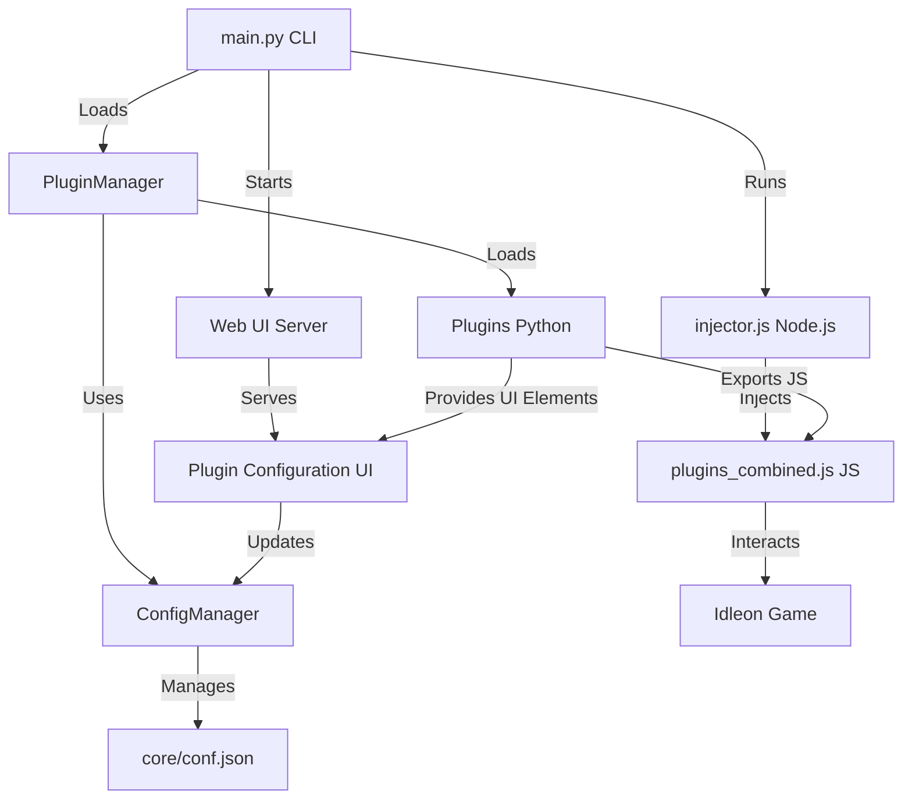

# IdleonWeb Development Guide

> **For users:** See [README.md](README.md) for user-friendly installation and usage instructions.
> **For quick start:** See [PLUGIN_QUICKSTART.md](PLUGIN_QUICKSTART.md) for rapid plugin development.
> **For comprehensive development:** This document contains detailed technical information for developers.

This document contains technical documentation for developers who want to understand, extend, or contribute to the IdleonWeb project.

## Table of Contents

- [Architecture Overview](#architecture-overview)
  - [Core Components](#core-components)
  - [JavaScript Injection Process](#javascript-injection-process)
- [Technical Setup](#technical-setup)
  - [Prerequisites](#prerequisites)
  - [Development Environment Setup](#development-environment-setup)
  - [Manual Setup](#manual-setup-advanced)
- [Plugin System](#plugin-system)
  - [Plugin Architecture](#plugin-architecture)
  - [Plugin Lifecycle](#plugin-lifecycle)
  - [Required Methods](#required-methods)
  - [Plugin Categories](#plugin-categories)
  - [Folderized Plugins](#folderized-plugins)
- [UI Decorators](#ui-decorators)
  - [Available UI Decorators](#available-ui-decorators)
  - [Autocomplete Naming Convention](#autocomplete-naming-convention)
  - [UI Decorator Parameters](#ui-decorator-parameters)
  - [Element-Specific Parameters](#element-specific-parameters)
- [Complete Plugin Example](#complete-plugin-example)
- [JavaScript Generation and Injection](#javascript-generation-and-injection)
  - [JavaScript Generation Process](#javascript-generation-process)
  - [Generated JavaScript Structure](#generated-javascript-structure)
  - [Parameter Handling](#parameter-handling)
  - [Debug Mode](#debug-mode)
  - [Game Context Access](#game-context-access)
  - [Common Patterns](#common-patterns)
- [JavaScript Exports](#javascript-exports)
- [Best Practices](#best-practices)
- [Configuration System](#configuration-system)
  - [Configuration Structure](#configuration-structure)
  - [Configuration Management](#configuration-management)
- [CLI Interface](#cli-interface)
  - [Available Commands](#available-commands)
  - [Plugin Commands](#plugin-commands)
- [Web UI System](#web-ui-system)
  - [Architecture](#architecture)
  - [Template Structure](#template-structure)
  - [API Endpoints](#api-endpoints)
- [Build and Release Pipeline](#build-and-release-pipeline)
  - [Integration Testing Pipeline](#integration-testing-pipeline)
  - [Automated Build Process](#automated-build-process)
  - [Cross-Platform Support](#cross-platform-support)
  - [Manual Build Workflow](#manual-build-workflow)
- [Troubleshooting](#troubleshooting)
  - [Development Issues](#development-issues)
  - [Common Error Messages](#common-error-messages)
- [Project Structure](#project-structure)
- [Contributing](#contributing)
  - [Development Workflow](#development-workflow)
  - [Code Style](#code-style)
  - [Plugin Development](#plugin-development)
- [License](#license)
- [Credits](#credits)

---

## Architecture Overview

IdleonWeb is designed for modularity and extensibility. The core components interact as follows:



### Core Components

- **main.py**: Entry point, provides the CLI, manages plugin loading, configuration, and launches the injector and web UI server.
- **PluginManager**: Loads and manages all plugins, handles lifecycle events, and exposes plugin commands to the CLI and web UI.
- **Plugins**: Python classes that can define CLI commands, export JavaScript, and provide UI elements for web configuration.
- **ConfigManager**: Singleton for all configuration, providing atomic get/set operations and automatic saving to `core/conf.json`.
- **injector.js**: Node.js script that launches Chromium, intercepts the game's JS, and injects the combined plugin code.
- **plugins_combined.js**: All plugin JS exports are merged here and injected into the game context.
- **Web UI Server**: Serves a modern web interface for plugin configuration with real-time updates and dynamic UI elements.

### JavaScript Injection Process

1. **Plugin Loading**: Python plugins are loaded and their `@js_export` functions are discovered
2. **Code Generation**: Each plugin's JavaScript is wrapped with game-ready checks and error handling
3. **Combination**: All plugin JavaScript is merged into a single `plugins_combined.js` file
4. **Browser Launch**: Chromium is launched with remote debugging enabled
5. **Network Interception**: The injector intercepts requests for game JavaScript files
6. **Code Injection**: The combined plugin JavaScript is prepended to the game's main JavaScript file
7. **Game Integration**: Plugin functions become available in the game's JavaScript context

---

## Technical Setup

### Prerequisites

- **Python 3.8+** with pip
- **Node.js 14+** with npm
- **Chrome/Chromium** browser
- **Git** (for development)

### Development Environment Setup

#### Universal Setup (Recommended)
```bash
# Clone the repository
git clone <repo-url>
cd IdleonWeb

# Run automated setup (works on all platforms)
python setup.py

# Activate virtual environment
# Windows Command Prompt:
.venv\Scripts\activate.bat
# Windows PowerShell:
.venv\Scripts\Activate.ps1
# Linux/macOS:
source .venv/bin/activate

# Start development
python main.py
```

#### Platform-Specific Setup
**All Platforms:**
```bash
python setup.py
```

### Manual Setup (Advanced)

1. **Create Python virtual environment:**
   ```bash
   python3 -m venv .venv
   source .venv/bin/activate  # Linux/macOS
   # or
   .venv\Scripts\activate     # Windows
   ```

2. **Install Python dependencies:**
   ```bash
   pip install -r requirements.txt
   ```

3. **Install Node.js dependencies:**
   ```bash
   cd core
   npm install
   cd ..
   ```

4. **Run the launcher:**
   ```bash
   python main.py
   ```

---

## Plugin System

### Plugin Architecture

Plugins are Python classes that inherit from `PluginBase` and can:

- **Export JavaScript** to be injected into the game
- **Provide CLI commands** accessible via the command line
- **Create UI elements** for the web interface
- **React to lifecycle events** (game ready, config changes, etc.)

### Plugin Lifecycle

1. **Loading**: Plugin class is imported and instantiated
2. **Initialization**: `initialize()` called with injector instance
3. **Configuration**: Plugin config loaded from `core/conf.json`
4. **Game Ready**: `on_game_ready()` called when game is fully loaded
5. **Runtime**: `update()` called every second while running
6. **Cleanup**: `cleanup()` called when shutting down

### Required Methods

Every plugin must implement these abstract methods:

```python
async def cleanup(self) -> None:
    """Clean up resources when plugin is unloaded."""
    
async def update(self) -> None:
    """Called every second while the injector is running."""
    
async def on_config_changed(self, config: Dict[str, Any]) -> None:
    """Called when plugin configuration changes."""
    
async def on_game_ready(self) -> None:
    """Called when the Idleon game is fully loaded and ready."""
```

### Plugin Categories

Plugins can be organized into categories using the `CATEGORY` attribute:

```python
class MyPlugin(PluginBase):
    VERSION = "1.0.0"
    DESCRIPTION = "My awesome plugin"
    PLUGIN_ORDER = 1  # Control display order (lower = first)
    CATEGORY = "Character"  # Available: Character, QoL, Unlocks, World 1, etc.
```

#### Available Categories
- **`"Character"`** - Character-related features (stats, abilities, inventory)
- **`"QoL"`** - Quality of Life improvements (convenience features)
- **`"Unlocks"`** - Unlock-related features (cards, vault, packages)
- **`"World 1"`**, **`"World 2"`**, etc. - World-specific features
- **`"Sneaking"`** - Sneaking game related features

### Folderized Plugins

Plugins can be organized in subdirectories for better structure:

```
plugins/
├── character/
│   ├── godlike_powers.py
│   ├── spawn_item.py
│   └── stats_multiplier.py
├── qol/
│   └── global_storage.py
├── unlocks/
│   ├── card_cheats.py
│   └── vault_unlocker.py
└── world1/
    └── anvil_cheats.py
```

**Plugin names** in subdirectories use dot notation:
- `plugins/character/godlike_powers.py` → Plugin name: `character.godlike_powers`
- `plugins/unlocks/card_cheats.py` → Plugin name: `unlocks.card_cheats`

The system automatically discovers and loads plugins from subdirectories.

---

## UI Decorators

### Available UI Decorators

- **`@ui_toggle`** - Toggle switches for boolean values
- **`@ui_button`** - Action buttons that execute functions
- **`@ui_slider`** - Range sliders for numeric values
- **`@ui_select`** - Dropdown selections
- **`@ui_text_input`** - Text input fields
- **`@ui_number_input`** - Numeric input fields
- **`@ui_input_with_button`** - Input field with execute button
- **`@ui_search_with_results`** - Search input with results display
- **`@ui_autocomplete_input`** - Input with autocomplete suggestions
- **`@ui_banner`** - Informational banner / warning element

### Autocomplete Naming Convention

For any UI element named `{element_name}_ui`, the system automatically looks for a corresponding autocomplete function named `get_{element_name}_autocomplete`.

**Example:**
- UI Element: `spawn_item_ui` → Element name: `spawn_item`
- Autocomplete Function: `get_spawn_autocomplete` → Matches pattern `get_{element_name}_autocomplete`

### UI Decorator Parameters

Each UI decorator accepts the following common parameters:

- **`label`** - Display name for the UI element
- **`description`** - Help text shown below the element
- **`category`** - Groups elements in the web UI (e.g., "General Settings", "Actions")
- **`order`** - Display order within the category (lower numbers appear first)

### UI Category System and Sorting

The web UI automatically organizes UI elements into categories for better user experience:

**Category Organization:**
- Elements with the same `category` parameter are grouped together
- Categories are sorted alphabetically
- Elements within each category are sorted by their `order` parameter
- Elements without a category default to "General"

**Category Examples:**
```python
@ui_toggle(
    label="Enable Feature",
    category="Core Settings",  # Groups with other "Core Settings"
    order=1  # First in the category
)
async def enable_feature_ui(self, value=None):
    pass

@ui_slider(
    label="Speed Multiplier", 
    category="Performance",  # Different category
    order=1
)
async def speed_ui(self, value=None):
    pass

@ui_button(
    label="Test Action",
    category="Actions",  # Action buttons category
    order=1
)
async def test_action_ui(self):
    pass
```

**Category Sorting Rules:**
1. **Alphabetical**: Categories are sorted A-Z
2. **Element Order**: Within each category, elements are sorted by `order` (lower numbers first)
3. **Default Category**: Elements without `category` go to "General"
4. **Default Order**: Elements without `order` default to 0

**Common Category Names:**
- `"General"` - Default category for basic settings
- `"Core Settings"` - Essential plugin configuration
- `"Performance"` - Speed, efficiency, and optimization settings
- `"Actions"` - Buttons and interactive elements
- `"Debug"` - Debugging and development tools
- `"Advanced"` - Advanced or experimental features
- `"Customization"` - User customization options

> **For quick UI examples, see [PLUGIN_QUICKSTART.md](PLUGIN_QUICKSTART.md#3-add-ui-elements)**

#### Element-Specific Parameters

**`@ui_toggle`:**
- `config_key` - Key in plugin config to bind to
- `default_value` - Initial boolean value (True/False)

**`@ui_slider`:**
- `config_key` - Key in plugin config to bind to
- `default_value` - Initial numeric value
- `min_value` - Minimum allowed value
- `max_value` - Maximum allowed value
- `step` - Step increment for the slider

**`@ui_select`:**
- `config_key` - Key in plugin config to bind to
- `default_value` - Initial selected value
- `options` - List of option dictionaries with `label` and `value`

**`@ui_text_input` / `@ui_number_input`:**
- `config_key` - Key in plugin config to bind to
- `default_value` - Initial text/numeric value
- `placeholder` - Placeholder text shown when empty
- `required` - Whether the field is required (boolean)

**`@ui_button`:**
- No additional parameters (just executes the function)

**`@ui_input_with_button`:**
- `button_text` - Text shown on the button
- `placeholder` - Placeholder text for the input field

**`@ui_search_with_results`:**
- `button_text` - Text shown on the search button
- `placeholder` - Placeholder text for the search field

**`@ui_autocomplete_input`:**
- `button_text` - Text shown on the execute button
- `placeholder` - Placeholder text for the input field

---

## Complete Plugin Example

```python
from plugin_system import (
    PluginBase, plugin_command, js_export, 
    ui_toggle, ui_button, ui_slider, ui_select, 
    ui_text_input, ui_number_input, ui_input_with_button,
    ui_search_with_results, ui_autocomplete_input
)
from config_manager import config_manager

class ExamplePlugin(PluginBase):
    VERSION = "1.0.0"
    DESCRIPTION = "Example plugin demonstrating all UI elements"
    PLUGIN_ORDER = 1
    CATEGORY = "Character"

    def __init__(self, config=None):
        super().__init__(config or {})
        self.injector = None
        self.name = 'example_plugin'
        self.debug = config_manager.get_path('plugin_configs.example_plugin.debug', False)

    # Required lifecycle methods
    async def cleanup(self):
        if self.debug:
            console.print(f"[ExamplePlugin] Cleaning up resources")

    async def update(self):
        # Periodic updates (called every second)
        pass

    async def on_config_changed(self, config):
        if self.debug:
            console.print(f"[ExamplePlugin] Config changed: {config}")
        if hasattr(self, 'injector') and self.injector:
            self.set_config(config)

    async def on_game_ready(self):
        if self.debug:
            console.print(f"[ExamplePlugin] Game is ready, setting up features")

    # UI Elements Examples

    @ui_toggle(
        label="Enable Feature",
        description="Toggle the main feature on/off",
        config_key="enabled",
        default_value=True,
        category="General Settings",
        order=1
    )
    async def enable_feature_ui(self, value: bool = None):
        if value is not None:
            self.config["enabled"] = value
            self.save_to_global_config()
        return f"Feature {'enabled' if self.config.get('enabled', True) else 'disabled'}"

    @ui_slider(
        label="Speed Multiplier",
        description="Adjust the speed multiplier (1-10x)",
        config_key="speed_multiplier",
        default_value=2,
        min_value=1,
        max_value=10,
        step=0.5,
        category="Performance",
        order=1
    )
    async def speed_multiplier_ui(self, value: float = None):
        if value is not None:
            self.config["speed_multiplier"] = value
            self.save_to_global_config()
        return f"Speed multiplier set to {self.config.get('speed_multiplier', 2)}x"

    @ui_select(
        label="Target Mode",
        description="Select the targeting mode",
        config_key="target_mode",
        default_value="auto",
        options=[
            {"label": "Automatic", "value": "auto"},
            {"label": "Manual", "value": "manual"},
            {"label": "Smart", "value": "smart"}
        ],
        category="Targeting",
        order=1
    )
    async def target_mode_ui(self, value: str = None):
        if value is not None:
            self.config["target_mode"] = value
            self.save_to_global_config()
        return f"Target mode: {self.config.get('target_mode', 'auto')}"

    @ui_text_input(
        label="Custom Message",
        description="Enter a custom message to display",
        config_key="custom_message",
        default_value="Hello World",
        placeholder="Enter your message here",
        required=True,
        category="Customization",
        order=1
    )
    async def custom_message_ui(self, value: str = None):
        if value is not None:
            self.config["custom_message"] = value
            self.save_to_global_config()
        return f"Message set to: {self.config.get('custom_message', 'Hello World')}"

    @ui_number_input(
        label="Item Count",
        description="Number of items to process",
        config_key="item_count",
        default_value=10,
        min_value=1,
        max_value=1000,
        step=1,
        category="Items",
        order=1
    )
    async def item_count_ui(self, value: int = None):
        if value is not None:
            self.config["item_count"] = value
            self.save_to_global_config()
        return f"Item count: {self.config.get('item_count', 10)}"

    @ui_button(
        label="Test Connection",
        description="Test the connection to the game",
        category="Actions",
        order=1
    )
    async def test_connection_ui(self):
        if hasattr(self, 'injector') and self.injector:
            try:
                result = self.run_js_export('test_connection_js', self.injector)
                return f"SUCCESS: Connection test - {result}"
            except Exception as e:
                return f"ERROR: Connection test failed - {str(e)}"
        else:
            return "ERROR: No injector available - run 'inject' first"

    @ui_input_with_button(
        label="Execute Command",
        description="Execute a custom command",
        button_text="Execute",
        placeholder="Enter command (e.g. 'spawn Copper 5')",
        category="Commands",
        order=1
    )
    async def execute_command_ui(self, value: str = None):
        if value and hasattr(self, 'injector') and self.injector:
            try:
                result = self.run_js_export('execute_command_js', self.injector, command=value)
                return f"SUCCESS: {result}"
            except Exception as e:
                return f"ERROR: {str(e)}"
        return "Enter a command to execute"

    @ui_search_with_results(
        label="Search Items",
        description="Search for items in the game",
        button_text="Search",
        placeholder="Enter search term (e.g. 'Copper', 'Sword')",
        category="Search",
        order=1
    )
    async def search_items_ui(self, value: str = None):
        if hasattr(self, 'injector') and self.injector:
            try:
                if value and value.strip():
                    result = self.run_js_export('search_items_js', self.injector, query=value.strip())
                    return result
                else:
                    return "Please enter a search term"
            except Exception as e:
                return f"ERROR: Search failed - {str(e)}"
        else:
            return "ERROR: No injector available - run 'inject' first"

    @ui_autocomplete_input(
        label="Spawn Item",
        description="Spawn an item with autocomplete",
        button_text="Spawn",
        placeholder="Item name (e.g. Copper, Sword)",
        category="Spawn",
        order=1
    )
    async def spawn_item_ui(self, value: str = None):
        if value and hasattr(self, 'injector') and self.injector:
            try:
                result = self.run_js_export('spawn_item_js', self.injector, item=value)
                return f"SUCCESS: {result}"
            except Exception as e:
                return f"ERROR: {str(e)}"
        return "Enter item name to spawn"

    # Autocomplete function (follows naming convention)
    async def get_spawn_autocomplete(self, query: str = ""):
        """Autocomplete function for spawn_item_ui"""
        if not hasattr(self, 'injector') or not self.injector:
            return []
        
        try:
            # Get item list from game
            result = self.run_js_export('get_item_list_js', self.injector)
            if result and not result.startswith("Error:"):
                items = result.split('\n')
                suggestions = []
                query_lower = query.lower()
                
                for item in items:
                    if query_lower in item.lower():
                        suggestions.append(item.split(' : ')[0] if ' : ' in item else item)
                
                return suggestions[:10]  # Limit to 10 suggestions
            return []
        except Exception as e:
            return []

    # CLI Commands
    @plugin_command(
        help="Test the plugin connection",
        params=[],
    )
    async def test_connection(self, injector=None, **kwargs):
        if self.debug:
            console.print(f"[ExamplePlugin] Testing connection...")
        return self.run_js_export('test_connection_js', injector)

    @plugin_command(
        help="Execute a custom command",
        params=[
            {"name": "command", "type": str, "help": "Command to execute"},
        ],
    )
    async def execute_command(self, command: str, injector=None, **kwargs):
        if self.debug:
            console.print(f"[ExamplePlugin] Executing command: {command}")
        return self.run_js_export('execute_command_js', injector, command=command)

---

## JavaScript Generation and Injection

The plugin system automatically generates and injects JavaScript code into the game. Here's how it works:

### JavaScript Generation Process

1. **Function Discovery**: The system scans all plugin methods ending with `_js`
2. **Parameter Extraction**: Extracts parameter names from the `@js_export` decorator
3. **Code Generation**: Wraps your JavaScript with game-ready checks and error handling
4. **Combination**: All plugin JavaScript is merged into `core/plugins_combined.js`
5. **Injection**: The combined JavaScript is injected into the game context

### Naming Convention

**Important**: All `@js_export` functions must end with `_js` in their function name. The system automatically removes the `_js` suffix when creating the JavaScript function name.

```python
@js_export()
def my_function_js(self):  # ← Must end with _js
    return "console.log('Hello World');"
```

**Becomes available in JavaScript as:**
```javascript
window.plugin_name.my_function()  // ← _js suffix removed, grouped under plugin namespace
```

### Generated JavaScript Structure

Your JavaScript code gets automatically wrapped. The function name is derived from your Python function name with the `_js` suffix removed and grouped under the plugin's namespace:

```javascript
// Original function: spawn_item_js() becomes window.plugin_name.spawn_item()
window.plugin_name = window.plugin_name || {};
window.plugin_name.spawn_item = async function(item, amount) {
    try {
        await window.__idleon_wait_for_game_ready();
        
        // Your JavaScript code here
        const ctx = window.__idleon_cheats__;
        const engine = ctx["com.stencyl.Engine"].engine;
        
        console.log("Spawning item: " + item);
        
        return "Item spawned successfully!";
    } catch (e) {
        console.error('[spawn_item] Error:', e);
        return `Error: ${e.message}`;
    }
}
```

### Parameter Handling

**Python to JavaScript parameter mapping:**

```python
@js_export(params=["item", "amount"])
def spawn_item_js(self, item=None, amount=None):  # ← Must end with _js
    return f"console.log('Item: {item}, Amount: {amount}');"
```

**Becomes:**
```javascript
window.plugin_name.spawn_item = async function(item, amount) {  // ← _js suffix removed, grouped under plugin namespace
    // item and amount are passed from Python
    console.log('Item: ' + item + ', Amount: ' + amount);
}
```

### Debug Mode

When any plugin has `debug: true` in its config, the system generates debug files:

```
core/tmp_js/
├── SpawnItemPlugin_js_dump.js
├── InstantMobRespawnPlugin_js_dump.js
└── ...
```

These files contain the raw JavaScript generated for each plugin.

### Plugin Namespacing

JavaScript functions are automatically grouped under the plugin's namespace to avoid conflicts:

```javascript
// Functions are available as:
window.plugin_name.function_name()

// Examples:
window.spawn_item.spawn_item("Copper", 10)
window.godlike_powers.set_powers(true)
window.card_cheats.set_card_level("mushG", 5)
```

**Compatibility Layer**: The system includes a compatibility layer that automatically translates old-style `window.function_name()` calls to the appropriate plugin namespace, so existing code continues to work.

### Game Context Access

Always access the game through the `__idleon_cheats__` context:

```javascript
const ctx = window.__idleon_cheats__;
const engine = ctx["com.stencyl.Engine"].engine;
const itemDefs = engine.getGameAttribute("ItemDefinitionsGET").h;
const character = engine.getGameAttribute("OtherPlayers").h[engine.getGameAttribute("UserInfo")[0]];
```

### Common Patterns

**Spawning Items:**
```javascript
const dropFn = events(189);
dropFn._customBlock_DropSomething(itemId, amount, 0, 0, 2, y, 0, x, y);
```

**Modifying Game Values:**
```javascript
character.setValue("ActorEvents_20", "_PlayerSpeed", newSpeed);
```

**Getting Game Data:**
```javascript
const itemDefs = engine.getGameAttribute("ItemDefinitionsGET").h;
const monsterDefs = engine.getGameAttribute("MonsterDefinitionsGET").h;
```

**Plugin Configuration Access:**
```javascript
// Access plugin config in JavaScript
if (window.pluginConfigs && window.pluginConfigs['my_plugin']) {
    const config = window.pluginConfigs['my_plugin'];
    if (config.enabled) {
        // Do something when enabled
    }
}
```

---

## Hot Reload System

The plugin system supports hot reloading for rapid development and testing:

### Configuration Hot Reload
- Changes to `core/conf.json` are automatically detected
- Use the `reload_config` command to refresh plugin configurations
- Plugin configurations are immediately synchronized to the browser
- No need to restart the injector for config changes

### Plugin Hot Reload
- Plugin Python files can be modified while the system is running
- Use the `reload` command to reload all plugins
- JavaScript is automatically regenerated and reinjected
- UI elements are updated in the web interface

### JavaScript Hot Reload
- JavaScript code changes are automatically detected
- The system regenerates `core/plugins_combined.js` on plugin reload
- Browser JavaScript is automatically reinjected
- No need to refresh the browser page

### Hot Reload Workflow
```bash
# 1. Start the system
python main.py
inject

# 2. Make changes to plugin files
# Edit plugins/my_plugin.py

# 3. Reload plugins (regenerates JS and updates UI)
reload

# 4. Or reload just configuration
reload_config

# 5. Changes are immediately available in the game
```

### Development Tips
- Use `reload` during development to test changes quickly
- Use `reload_config` when only changing configuration values
- Monitor the console for any reload errors
- The web UI automatically updates when plugins are reloaded
- JavaScript errors are reported in the browser console

---

## Window Configuration System

The plugin system automatically synchronizes plugin configurations between Python and the browser's JavaScript context. This allows JavaScript code to access plugin settings in real-time.

### Configuration Structure

Plugin configurations are stored in the browser's `window` object under `window.pluginConfigs`:

```javascript
window.pluginConfigs = {
    "plugin_name": {
        "enabled": true,
        "speed_multiplier": 2.5,
        "custom_setting": "value",
        "debug": false
    },
    "another_plugin": {
        "enabled": false,
        "threshold": 100
    }
}
```

### How Configuration is Synchronized

1. **Initialization**: When a plugin is initialized, its configuration is automatically pushed to the browser:
   ```python
   # In PluginBase.init_config_in_browser()
   init_expr = "window.pluginConfigs = window.pluginConfigs || {};"
   self.injector.evaluate(init_expr)
   
   # Get current config and set it in browser
   current_config = config_manager.get_plugin_config(self.name)
   self.set_config(current_config)
   ```

2. **Real-time Updates**: When plugin configuration changes (via UI or CLI), it's immediately synchronized:
   ```python
   # In PluginBase.set_config()
   js_config = json.dumps(config)
   expr = f"window.pluginConfigs['{self.name}'] = {js_config};"
   self.injector.evaluate(expr)
   ```

3. **Automatic Persistence**: Changes are automatically saved to `core/conf.json`:
   ```python
   # In PluginBase.save_to_global_config()
   config_manager.set_plugin_config(self.name, config)
   ```

### Accessing Configuration in JavaScript

**Basic Access:**
```javascript
// Check if plugin is enabled
if (window.pluginConfigs && window.pluginConfigs['my_plugin']) {
    const config = window.pluginConfigs['my_plugin'];
    if (config.enabled) {
        console.log("Plugin is enabled!");
    }
}
```

**Safe Access with Defaults:**
```javascript
// Safe access with fallback values
const config = window.pluginConfigs?.['my_plugin'] || {};
const enabled = config.enabled || false;
const speed = config.speed_multiplier || 1.0;
```

**Real-time Configuration Checks:**
```javascript
// Check configuration in real-time
function checkPluginConfig() {
    const config = window.pluginConfigs?.['my_plugin'] || {};
    
    if (config.enabled) {
        // Apply enabled features
        applySpeedMultiplier(config.speed_multiplier || 1.0);
    } else {
        // Disable features
        resetSpeedMultiplier();
    }
}
```

### Why Configuration is in Window

1. **Real-time Access**: JavaScript code can check configuration values immediately without making requests back to Python
2. **Performance**: No need for async calls or polling to check plugin settings
3. **Simplicity**: Direct object access is faster and simpler than API calls
4. **Consistency**: Configuration is available in the same context as the game code
5. **Automatic Updates**: Changes from the web UI or CLI are immediately reflected in JavaScript

### Configuration Lifecycle

1. **Plugin Load**: Configuration is loaded from `core/conf.json`
2. **Browser Init**: Configuration is pushed to `window.pluginConfigs[plugin_name]`
3. **UI Changes**: Web UI updates trigger immediate browser synchronization
4. **CLI Changes**: Command line changes trigger immediate browser synchronization
5. **JavaScript Access**: JavaScript code can access current configuration at any time
6. **Persistence**: All changes are automatically saved to `core/conf.json`

### Best Practices

**Always Check for Existence:**
```javascript
// Good: Check if config exists
if (window.pluginConfigs && window.pluginConfigs['my_plugin']) {
    const config = window.pluginConfigs['my_plugin'];
    // Use config
}

// Bad: Direct access without checking
const config = window.pluginConfigs['my_plugin']; // Could be undefined
```

**Use Default Values:**
```javascript
// Good: Provide fallback values
const enabled = window.pluginConfigs?.['my_plugin']?.enabled || false;
const speed = window.pluginConfigs?.['my_plugin']?.speed_multiplier || 1.0;

// Bad: No fallback
const enabled = window.pluginConfigs['my_plugin'].enabled; // Could throw error
```

**Check Configuration Changes:**
```javascript
// Monitor configuration changes
function setupConfigWatcher() {
    const originalConfig = JSON.stringify(window.pluginConfigs?.['my_plugin'] || {});
    
    setInterval(() => {
        const currentConfig = JSON.stringify(window.pluginConfigs?.['my_plugin'] || {});
        if (currentConfig !== originalConfig) {
            console.log("Configuration changed, updating behavior...");
            updatePluginBehavior();
        }
    }, 1000);
}
```

**Handle Missing Configuration:**
```javascript
// Graceful handling of missing configuration
function getPluginConfig(pluginName, defaultValue = {}) {
    return window.pluginConfigs?.[pluginName] || defaultValue;
}

const config = getPluginConfig('my_plugin', { enabled: false, speed: 1.0 });
```

## JavaScript Exports

```python
@js_export()
def test_connection_js(self):  # ← Must end with _js
    return '''
    try {
        const ctx = window.__idleon_cheats__;
        if (ctx && ctx["com.stencyl.Engine"]) {
            return "Game connection successful";
        } else {
            return "Game not ready";
        }
    } catch (e) {
        return `Error: ${e.message}`;
    }
    '''

@js_export(params=["command"])
def execute_command_js(self, command=None):
    return f'''
    try {{
        console.log("Executing command: {command}");
        return "Command executed successfully";
    }} catch (e) {{
        return `Error: ${{e.message}}`;
    }}
    '''

@js_export(params=["query"])
def search_items_js(self, query=None):
    return f'''
    try {{
        const ctx = window.__idleon_cheats__;
        const itemDefs = ctx["com.stencyl.Engine"].engine.getGameAttribute("ItemDefinitionsGET").h;
        const q = "{query}".toLowerCase();

        const matches = Object.entries(itemDefs).filter(([id, def]) => {{
            const name = def?.h?.displayName || '';
            return id.toLowerCase().includes(q) || name.toLowerCase().includes(q);
        }});

        return matches.length
            ? matches.map(([id, def]) => `${{id}} : ${{def?.h?.displayName?.replace(/_/g, ' ') || id}}`).join("\n")
            : `No items found for: {query}`;
    }} catch (e) {{
        return `Error: ${{e.message}}`;
    }}
    '''

@js_export(params=["item"])
def spawn_item_js(self, item=None):
    return f'''
    try {{
        const ctx = window.__idleon_cheats__;
        const engine = ctx["com.stencyl.Engine"].engine;
        const itemDefs = engine.getGameAttribute("ItemDefinitionsGET").h;

        const itemDef = itemDefs["{item}"];
        if (!itemDef) return `No item found: '{{item}}'`;

        console.log(`Spawning item: ${{itemDef.h.displayName}}`);
        return `Spawned ${{itemDef.h.displayName}}`;
    }} catch (e) {{
        return `Error: ${{e.message}}`;
    }}
    '''

@js_export()
def get_item_list_js(self):
    return '''
    try {
        const ctx = window.__idleon_cheats__;
        const itemDefs = ctx["com.stencyl.Engine"].engine.getGameAttribute("ItemDefinitionsGET").h;

        return Object.entries(itemDefs)
            .map(([id, def]) => `${id} : ${def?.h?.displayName?.replace(/_/g, ' ') || id}`)
            .join("\n");
    } catch (e) {
        return `Error: ${e.message}`;
    }
    '''
```

---

## Best Practices

1. **Naming Convention**: Always end UI element functions with `_ui` (e.g., `spawn_item_ui`)
2. **JavaScript Exports**: Always end `@js_export` functions with `_js` (e.g., `spawn_item_js`)
3. **Autocomplete Functions**: Follow the pattern `get_{element_name}_autocomplete` for autocomplete inputs
4. **Config Keys**: Use descriptive config keys that match your plugin's functionality
5. **Categories**: Group related elements in the same category for better organization
6. **Error Handling**: Always check for injector availability and handle errors gracefully
7. **Return Values**: Return descriptive success/error messages for user feedback
8. **Debug Mode**: Use the plugin's debug flag for conditional logging
9. **Plugin Categories**: Use appropriate categories to organize plugins
10. **Plugin Ordering**: Set `PLUGIN_ORDER` to control display order
11. **Folder Structure**: Use subdirectories for better plugin organization

---

## Configuration System

### Configuration Structure

The application uses a centralized configuration system in `core/conf.json`. Key configuration sections:

**Global Settings:**
- `debug`: Enable/disable debug logging (default: false)
- `interactive`: Enable/disable interactive CLI mode (default: true)
- `openDevTools`: Open browser DevTools on injection (default: false)

**Web UI Settings:**
- `webui.darkmode`: Enable/disable dark mode for web interface (default: false)

**Injector Settings:**
- `injector.cdp_port`: Chrome DevTools Protocol port (default: 32123)
- `injector.njs_pattern`: Pattern for intercepting game JavaScript (default: "*N.js")
- `injector.idleon_url`: Idleon game URL (default: "https://www.legendsofidleon.com/ytGl5oc/")
- `injector.timeout`: Injection timeout in milliseconds (default: 120000)
- `injector.autoInject`: Automatically run injection after plugin discovery (default: true)
- `injector.idleon_url`: Game URL to launch (default: "https://www.legendsofidleon.com/ytGl5oc/")
- `injector.timeout`: Injection timeout in milliseconds (default: 120000)

**Plugin Configuration:**
- `plugins`: List of enabled plugin names (auto-populated by plugin discovery)
- `plugin_configs`: Per-plugin configuration settings (auto-created as plugins are enabled)

**Example Configuration Structure:**
```json
{
  "openDevTools": false,
  "interactive": true,
  "debug": false,
  "webui": {
    "darkmode": false
  },
  "injector": {
    "cdp_port": 32123,
    "njs_pattern": "*N.js",
    "idleon_url": "https://www.legendsofidleon.com/ytGl5oc/",
    "timeout": 120000,
    "autoInject": true
  },
    "idleon_url": "https://www.legendsofidleon.com/ytGl5oc/",
    "timeout": 120000
  },
  "plugins": [
    "spawn_item",
    "instant_mob_respawn"
  ],
  "plugin_configs": {
    "spawn_item": {
      "debug": false
    },
    "instant_mob_respawn": {
      "debug": false,
      "toggle": false
    }
  }
}
```

**Note:** The `plugins` list and `plugin_configs` are no longer included in the default configuration. The plugin auto-discovery system will automatically detect available plugins and offer to enable them on first run.

### Configuration Management

```python
from config_manager import config_manager

# Get plugin config
config = config_manager.get_plugin_config('my_plugin')

# Set plugin config
config_manager.set_plugin_config('my_plugin', {'enabled': True})

# Get global setting
debug = config_manager.get_global('debug', False)

# Set global setting
config_manager.set_global('debug', True)

# Path-based access
value = config_manager.get_path('plugin_configs.my_plugin.enabled', False)
config_manager.set_path('plugin_configs.my_plugin.enabled', True)
```


---

## Application Startup Flow

### Startup Sequence

1. **Configuration Loading**: Load configuration from `core/conf.json` or create default config
2. **Plugin Discovery**: Scan `plugins/` directory for available plugins (including subdirectories)
3. **Plugin Loading**: Load enabled plugins from configuration
4. **Plugin Auto-Discovery**: Check for new/unused plugins and offer to enable them
5. **Auto-Injection** (if enabled): Automatically run injection process
6. **CLI Initialization**: Start interactive command-line interface

### Plugin Auto-Discovery

The system automatically scans the `plugins/` directory to find available plugins:

- Searches in root `plugins/` directory for `.py` files
- Recursively searches subdirectories (e.g., `plugins/character/`, `plugins/world1/`)
- Compares found plugins with enabled plugins in configuration
- Offers to enable any unused plugins on startup

**User Options:**
- **`all`**: Enable all discovered plugins
- **`none`**: Skip enabling unused plugins
- **Plugin names**: Enable specific plugins (space-separated)

### Auto-Injection Feature

Auto-injection runs automatically after plugin discovery and before CLI starts:

- **Default**: Enabled (`injector.autoInject: true`)
- **Control**: Use `auto_inject on/off` CLI command
- **Timing**: Runs after plugin discovery, before CLI becomes interactive
- **Feedback**: Shows status in startup summary

**Benefits:**
- Streamlined user experience
- Immediate game enhancement on startup
- Can be disabled for manual control

---

## CLI Interface

### Available Commands

- **`inject`**: Run the injector with current config
- **`config`**: Show current injector config
- **`injector_config`**: Show injector-specific configuration (CDP port, URL, etc.)
- **`plugins`**: List loaded plugins
- **`reload_config`**: Reload plugin configurations from conf.json
- **`reload`**: Reload all plugins and regenerate JavaScript
- **`darkmode`**: Toggle dark mode for the web UI (on/off)
- **`auto_inject`**: Toggle auto-inject on startup (on/off)
- **`web_ui`**: Start the plugin web UI server
- **`help`**: Show help menu
- **`exit`**: Exit the CLI

### Plugin Commands

Plugin commands are accessed as `plugins.pluginname.command`:

```bash
# Example plugin commands
plugins.character.spawn_item.spawn "Copper" 5
plugins.character.instant_mob_respawn.toggle
```

---

## Web UI System

### Architecture

The web UI system consists of:

- **Web Server**: `webui/web_api_integration.py` - aiohttp-based server
- **Templates**: Jinja2 templates in `webui/templates/`
- **Frontend**: CSS and JavaScript in `webui/templates/css/` and `webui/templates/js/`
- **API Endpoints**: RESTful API for plugin interactions

### Template Structure

```
webui/templates/
├── css/
│   └── styles.css          # Web UI styling
├── js/
│   └── plugin-ui.js        # Frontend JavaScript
└── html/
    ├── base.html           # Base template
    ├── plugin_cards.html   # Single plugin layout
    ├── tabbed_interface.html # Multi-plugin layout
    ├── categorized_interface.html # Categorized plugin interface
    └── ui_elements.html    # UI element templates
```

### API Endpoints

- `GET /` - Main UI page
- `POST /api/ui_action` - Execute UI actions
- `GET /api/plugin_config` - Get plugin configuration
- `POST /api/plugin_config` - Update plugin configuration

---

## Build and Release Pipeline

IdleonWeb features a fully automated CI/CD pipeline that runs integration tests and builds standalone executables for multiple platforms.

### Integration Testing Pipeline

The main pipeline (`combined-tests-and-release.yml`) automatically triggers on:
- **Push to main branch**: Full integration tests + release build
- **Pull requests**: Integration tests only (no release)

**Integration Test Matrix:**
- 🐧 **Arch Linux**: Docker-based testing environment
- 🐧 **Ubuntu**: Docker-based testing environment  
- 🪟 **Windows**: Native Windows runner testing

**Test Process:**
1. **Code Quality Checks**: Syntax validation, import analysis
2. **Platform Testing**: Full functionality tests across all supported OS
3. **Plugin System Testing**: All plugins load and function correctly
4. **Integration Validation**: End-to-end workflow testing

### Automated Build Process

After all integration tests pass successfully:

**Build Matrix:**
- 🐧 **Linux**: Native PyInstaller build (guaranteed)
- 🪟 **Windows**: Cross-compile attempt (fallback to manual)
- 🍎 **macOS**: Cross-compile attempt (fallback to manual)

**Build Features:**
- **Standalone Executables**: No Python installation required
- **Embedded Runtime**: Python 3.11 runtime included
- **Config Persistence**: Configuration files stored alongside executable
- **Auto-Migration**: Automatic config format updates
- **Size Optimized**: ~27MB per platform
- **Timeout Protection**: 15-minute build timeout per platform

### Cross-Platform Support

**Primary Platform (Linux):**
- ✅ Full native builds guaranteed
- ✅ All features supported
- ✅ Complete integration testing

**Secondary Platforms (Windows/macOS):**
- 🔄 Cross-compilation attempted during CI
- 🏗️ Manual build workflow available
- 📦 GitHub Actions runners for native builds

**Platform-Specific Features:**
```json
{
  "linux": {
    "build_method": "native",
    "executable_format": "elf",
    "archive_format": "tar.gz"
  },
  "windows": {
    "build_method": "cross_compile_or_native",
    "executable_format": "exe", 
    "archive_format": "zip"
  },
  "macos": {
    "build_method": "cross_compile_or_native",
    "executable_format": "app",
    "archive_format": "tar.gz"
  }
}
```

### Manual Build Workflow

For emergency builds or testing, use the manual workflow:

```bash
# Trigger manual build via GitHub Actions
# 1. Go to GitHub Actions tab
# 2. Select "Manual Build Multi-Platform Releases"
# 3. Click "Run workflow"
# 4. Specify version (e.g., v1.2.3)
```

**Local Build Process:**
```bash
# Setup build environment
python -m venv .venv
source .venv/bin/activate  # Linux/macOS
# .venv\Scripts\activate   # Windows

# Install build dependencies
pip install -r requirements.txt
pip install -r build_process/build-requirements.txt

# Build standalone executable
python build_process/build_standalone.py --platform linux --output my_build --clean
```

**Build Configuration:**
- **PyInstaller**: v6.0+ for executable creation
- **Node.js**: v20+ for JavaScript bundling
- **Virtual Environment**: Isolated Python environment
- **Clean Builds**: Fresh compilation each time

### Release Artifacts

Each successful release includes:

**Executable Downloads:**
- `IdleonWeb-linux-v{version}.tar.gz` - Linux standalone
- `IdleonWeb-windows-v{version}.zip` - Windows standalone (if available)
- `IdleonWeb-macos-v{version}.tar.gz` - macOS standalone (if available)

**Source Code:**
- `IdleonWeb-source-v{version}.zip` - Complete source with documentation

**Release Metadata:**
- ✅ Integration test results for all platforms
- 📊 Build success/failure status per platform
- 📝 Automated version bumping
- 🏷️ Semantic versioning (major.minor.patch)

**Installation Instructions (included in release):**
1. Download appropriate platform archive
2. Extract to desired location
3. Run executable directly (no installation required)
4. Application creates `conf.json` in executable directory
5. Configuration persists between runs

---