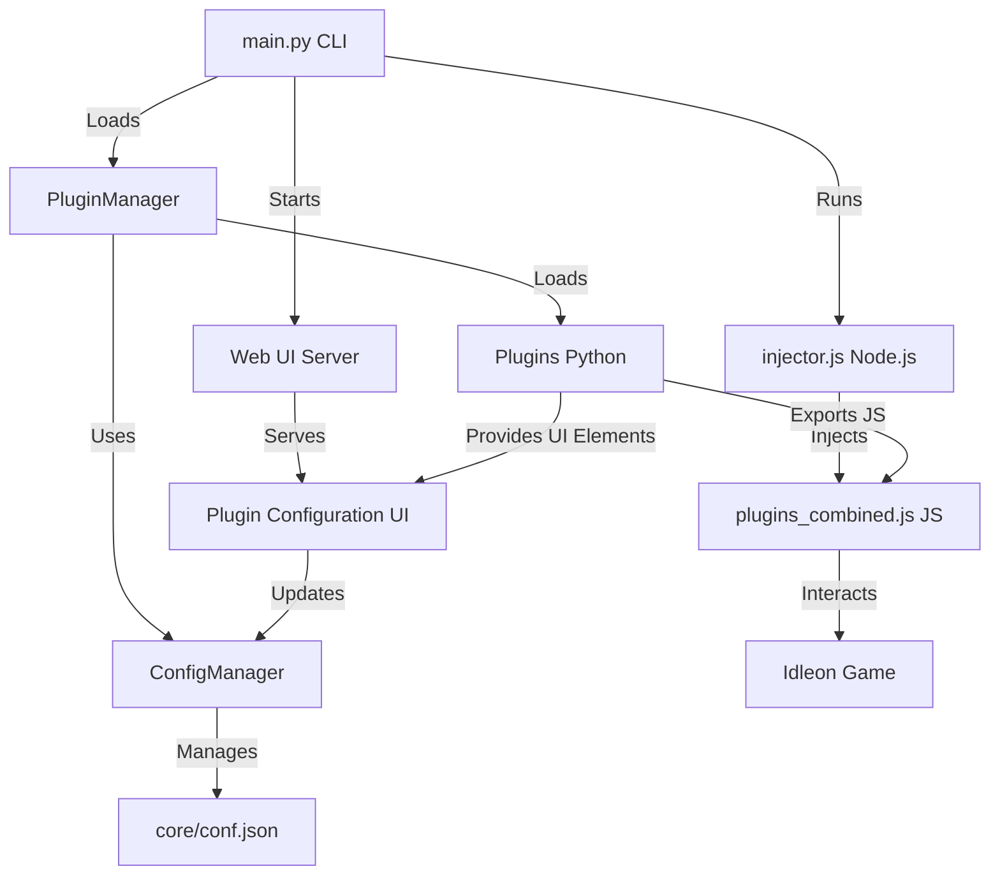

# IdleonWeb Development Guide

> **For users:** See [README.md](README.md) for user-friendly installation and usage instructions.

This document contains technical documentation for developers who want to understand, extend, or contribute to the IdleonWeb project.

---

## Architecture Overview

IdleonWeb is designed for modularity and extensibility. The core components interact as follows:



### Core Components

- **main.py**: Entry point, provides the CLI, manages plugin loading, configuration, and launches the injector and web UI server.
- **PluginManager**: Loads and manages all plugins, handles lifecycle events, and exposes plugin commands to the CLI and web UI.
- **Plugins**: Python classes that can define CLI commands, export JavaScript, and provide UI elements for web configuration.
- **ConfigManager**: Singleton for all configuration, providing atomic get/set operations and automatic saving to `core/conf.json`.
- **injector.js**: Node.js script that launches Chromium, intercepts the game's JS, and injects the combined plugin code.
- **plugins_combined.js**: All plugin JS exports are merged here and injected into the game context.
- **Web UI Server**: Serves a modern web interface for plugin configuration with real-time updates and dynamic UI elements.

---

## Technical Setup

### Prerequisites

- **Python 3.8+** with pip
- **Node.js 14+** with npm
- **Chrome/Chromium** browser
- **Git** (for development)

### Development Environment Setup

#### Universal Setup (Recommended)
```bash
# Clone the repository
git clone <repo-url>
cd IdleonWeb

# Run automated setup (works on all platforms)
python setup.py

# Activate virtual environment
# Windows Command Prompt:
.venv\Scripts\activate.bat
# Windows PowerShell:
.venv\Scripts\Activate.ps1
# Linux/macOS:
source .venv/bin/activate

# Start development
python main.py
```

#### Platform-Specific Setup
**Linux/macOS:**
```bash
./setup.sh
```

**Windows:**
```cmd
python setup_windows.py
```

### Manual Setup (Advanced)

1. **Create Python virtual environment:**
   ```bash
   python3 -m venv .venv
   source .venv/bin/activate  # Linux/macOS
   # or
   .venv\Scripts\activate     # Windows
   ```

2. **Install Python dependencies:**
   ```bash
   pip install -r requirements.txt
   ```

3. **Install Node.js dependencies:**
   ```bash
   cd core
   npm install
   cd ..
   ```

4. **Run the launcher:**
   ```bash
   python main.py
   ```

---

## Plugin System

### Plugin Architecture

Plugins are Python classes that inherit from `PluginBase` and can:

- **Export JavaScript** to be injected into the game
- **Provide CLI commands** accessible via the command line
- **Create UI elements** for the web interface
- **React to lifecycle events** (game ready, config changes, etc.)

### Plugin Lifecycle

1. **Loading**: Plugin class is imported and instantiated
2. **Initialization**: `initialize()` called with injector instance
3. **Configuration**: Plugin config loaded from `core/conf.json`
4. **Game Ready**: `on_game_ready()` called when game is fully loaded
5. **Runtime**: `update()` called every second while running
6. **Cleanup**: `cleanup()` called when shutting down

### Required Methods

Every plugin must implement these abstract methods:

```python
async def cleanup(self) -> None:
    """Clean up resources when plugin is unloaded."""
    
async def update(self) -> None:
    """Called every second while the injector is running."""
    
async def on_config_changed(self, config: Dict[str, Any]) -> None:
    """Called when plugin configuration changes."""
    
async def on_game_ready(self) -> None:
    """Called when the Idleon game is fully loaded and ready."""
```

---

## UI Decorators

### Available UI Decorators

- **`@ui_toggle`** - Toggle switches for boolean values
- **`@ui_button`** - Action buttons that execute functions
- **`@ui_slider`** - Range sliders for numeric values
- **`@ui_select`** - Dropdown selections
- **`@ui_text_input`** - Text input fields
- **`@ui_number_input`** - Numeric input fields
- **`@ui_input_with_button`** - Input field with execute button
- **`@ui_search_with_results`** - Search input with results display
- **`@ui_autocomplete_input`** - Input with autocomplete suggestions

### Autocomplete Naming Convention

For any UI element named `{element_name}_ui`, the system automatically looks for a corresponding autocomplete function named `get_{element_name}_autocomplete`.

**Example:**
- UI Element: `spawn_item_ui` → Element name: `spawn_item`
- Autocomplete Function: `get_spawn_autocomplete` → Matches pattern `get_{element_name}_autocomplete`

### UI Decorator Parameters

Each UI decorator accepts the following common parameters:

- **`label`** - Display name for the UI element
- **`description`** - Help text shown below the element
- **`category`** - Groups elements in the web UI (e.g., "General Settings", "Actions")
- **`order`** - Display order within the category (lower numbers appear first)

#### Element-Specific Parameters

**`@ui_toggle`:**
- `config_key` - Key in plugin config to bind to
- `default_value` - Initial boolean value (True/False)

**`@ui_slider`:**
- `config_key` - Key in plugin config to bind to
- `default_value` - Initial numeric value
- `min_value` - Minimum allowed value
- `max_value` - Maximum allowed value
- `step` - Step increment for the slider

**`@ui_select`:**
- `config_key` - Key in plugin config to bind to
- `default_value` - Initial selected value
- `options` - List of option dictionaries with `label` and `value`

**`@ui_text_input` / `@ui_number_input`:**
- `config_key` - Key in plugin config to bind to
- `default_value` - Initial text/numeric value
- `placeholder` - Placeholder text shown when empty
- `required` - Whether the field is required (boolean)

**`@ui_button`:**
- No additional parameters (just executes the function)

**`@ui_input_with_button`:**
- `button_text` - Text shown on the button
- `placeholder` - Placeholder text for the input field

**`@ui_search_with_results`:**
- `button_text` - Text shown on the search button
- `placeholder` - Placeholder text for the search field

**`@ui_autocomplete_input`:**
- `button_text` - Text shown on the execute button
- `placeholder` - Placeholder text for the input field

---

## Complete Plugin Example

```python
from plugin_system import (
    PluginBase, plugin_command, js_export, 
    ui_toggle, ui_button, ui_slider, ui_select, 
    ui_text_input, ui_number_input, ui_input_with_button,
    ui_search_with_results, ui_autocomplete_input
)
from config_manager import config_manager

class ExamplePlugin(PluginBase):
    VERSION = "1.0.0"
    DESCRIPTION = "Example plugin demonstrating all UI elements"

    def __init__(self, config=None):
        super().__init__(config or {})
        self.injector = None
        self.name = 'example_plugin'
        self.debug = config_manager.get_path('plugin_configs.example_plugin.debug', False)

    # Required lifecycle methods
    async def cleanup(self):
        if self.debug:
            console.print(f"[ExamplePlugin] Cleaning up resources")

    async def update(self):
        # Periodic updates (called every second)
        pass

    async def on_config_changed(self, config):
        if self.debug:
            console.print(f"[ExamplePlugin] Config changed: {config}")
        if hasattr(self, 'injector') and self.injector:
            self.set_config(config)

    async def on_game_ready(self):
        if self.debug:
            console.print(f"[ExamplePlugin] Game is ready, setting up features")

    # UI Elements Examples

    @ui_toggle(
        label="Enable Feature",
        description="Toggle the main feature on/off",
        config_key="enabled",
        default_value=True,
        category="General Settings",
        order=1
    )
    async def enable_feature_ui(self, value: bool = None):
        if value is not None:
            self.config["enabled"] = value
            self.save_to_global_config()
        return f"Feature {'enabled' if self.config.get('enabled', True) else 'disabled'}"

    @ui_slider(
        label="Speed Multiplier",
        description="Adjust the speed multiplier (1-10x)",
        config_key="speed_multiplier",
        default_value=2,
        min_value=1,
        max_value=10,
        step=0.5,
        category="Performance",
        order=1
    )
    async def speed_multiplier_ui(self, value: float = None):
        if value is not None:
            self.config["speed_multiplier"] = value
            self.save_to_global_config()
        return f"Speed multiplier set to {self.config.get('speed_multiplier', 2)}x"

    @ui_select(
        label="Target Mode",
        description="Select the targeting mode",
        config_key="target_mode",
        default_value="auto",
        options=[
            {"label": "Automatic", "value": "auto"},
            {"label": "Manual", "value": "manual"},
            {"label": "Smart", "value": "smart"}
        ],
        category="Targeting",
        order=1
    )
    async def target_mode_ui(self, value: str = None):
        if value is not None:
            self.config["target_mode"] = value
            self.save_to_global_config()
        return f"Target mode: {self.config.get('target_mode', 'auto')}"

    @ui_text_input(
        label="Custom Message",
        description="Enter a custom message to display",
        config_key="custom_message",
        default_value="Hello World",
        placeholder="Enter your message here",
        required=True,
        category="Customization",
        order=1
    )
    async def custom_message_ui(self, value: str = None):
        if value is not None:
            self.config["custom_message"] = value
            self.save_to_global_config()
        return f"Message set to: {self.config.get('custom_message', 'Hello World')}"

    @ui_number_input(
        label="Item Count",
        description="Number of items to process",
        config_key="item_count",
        default_value=10,
        min_value=1,
        max_value=1000,
        step=1,
        category="Items",
        order=1
    )
    async def item_count_ui(self, value: int = None):
        if value is not None:
            self.config["item_count"] = value
            self.save_to_global_config()
        return f"Item count: {self.config.get('item_count', 10)}"

    @ui_button(
        label="Test Connection",
        description="Test the connection to the game",
        category="Actions",
        order=1
    )
    async def test_connection_ui(self):
        if hasattr(self, 'injector') and self.injector:
            try:
                result = self.run_js_export('test_connection_js', self.injector)
                return f"SUCCESS: Connection test - {result}"
            except Exception as e:
                return f"ERROR: Connection test failed - {str(e)}"
        else:
            return "ERROR: No injector available - run 'inject' first"

    @ui_input_with_button(
        label="Execute Command",
        description="Execute a custom command",
        button_text="Execute",
        placeholder="Enter command (e.g. 'spawn Copper 5')",
        category="Commands",
        order=1
    )
    async def execute_command_ui(self, value: str = None):
        if value and hasattr(self, 'injector') and self.injector:
            try:
                result = self.run_js_export('execute_command_js', self.injector, command=value)
                return f"SUCCESS: {result}"
            except Exception as e:
                return f"ERROR: {str(e)}"
        return "Enter a command to execute"

    @ui_search_with_results(
        label="Search Items",
        description="Search for items in the game",
        button_text="Search",
        placeholder="Enter search term (e.g. 'Copper', 'Sword')",
        category="Search",
        order=1
    )
    async def search_items_ui(self, value: str = None):
        if hasattr(self, 'injector') and self.injector:
            try:
                if value and value.strip():
                    result = self.run_js_export('search_items_js', self.injector, query=value.strip())
                    return result
                else:
                    return "Please enter a search term"
            except Exception as e:
                return f"ERROR: Search failed - {str(e)}"
        else:
            return "ERROR: No injector available - run 'inject' first"

    @ui_autocomplete_input(
        label="Spawn Item",
        description="Spawn an item with autocomplete",
        button_text="Spawn",
        placeholder="Item name (e.g. Copper, Sword)",
        category="Spawn",
        order=1
    )
    async def spawn_item_ui(self, value: str = None):
        if value and hasattr(self, 'injector') and self.injector:
            try:
                result = self.run_js_export('spawn_item_js', self.injector, item=value)
                return f"SUCCESS: {result}"
            except Exception as e:
                return f"ERROR: {str(e)}"
        return "Enter item name to spawn"

    # Autocomplete function (follows naming convention)
    async def get_spawn_autocomplete(self, query: str = ""):
        """Autocomplete function for spawn_item_ui"""
        if not hasattr(self, 'injector') or not self.injector:
            return []
        
        try:
            # Get item list from game
            result = self.run_js_export('get_item_list_js', self.injector)
            if result and not result.startswith("Error:"):
                items = result.split('\n')
                suggestions = []
                query_lower = query.lower()
                
                for item in items:
                    if query_lower in item.lower():
                        suggestions.append(item.split(' : ')[0] if ' : ' in item else item)
                
                return suggestions[:10]  # Limit to 10 suggestions
            return []
        except Exception as e:
            return []

    # CLI Commands
    @plugin_command(
        help="Test the plugin connection",
        params=[],
    )
    async def test_connection(self, injector=None, **kwargs):
        if self.debug:
            console.print(f"[ExamplePlugin] Testing connection...")
        return self.run_js_export('test_connection_js', injector)

    @plugin_command(
        help="Execute a custom command",
        params=[
            {"name": "command", "type": str, "help": "Command to execute"},
        ],
    )
    async def execute_command(self, command: str, injector=None, **kwargs):
        if self.debug:
            console.print(f"[ExamplePlugin] Executing command: {command}")
        return self.run_js_export('execute_command_js', injector, command=command)

    # JavaScript Exports
    @js_export()
    def test_connection_js(self):
        return '''
        try {
            const ctx = window.__idleon_cheats__;
            if (ctx && ctx["com.stencyl.Engine"]) {
                return "Game connection successful";
            } else {
                return "Game not ready";
            }
        } catch (e) {
            return `Error: ${e.message}`;
        }
        '''

    @js_export(params=["command"])
    def execute_command_js(self, command=None):
        return f'''
        try {{
            console.log("Executing command: {command}");
            return "Command executed successfully";
        }} catch (e) {{
            return `Error: ${{e.message}}`;
        }}
        '''

    @js_export(params=["query"])
    def search_items_js(self, query=None):
        return f'''
        try {{
            const ctx = window.__idleon_cheats__;
            const itemDefs = ctx["com.stencyl.Engine"].engine.getGameAttribute("ItemDefinitionsGET").h;
            const q = "{query}".toLowerCase();
            
            const matches = Object.entries(itemDefs).filter(([id, def]) => {{
                const name = def?.h?.displayName || '';
                return id.toLowerCase().includes(q) || name.toLowerCase().includes(q);
            }});
            
            return matches.length 
                ? matches.map(([id, def]) => `${{id}} : ${{def?.h?.displayName?.replace(/_/g, ' ') || id}}`).join("\\n")
                : `No items found for: {query}`;
        }} catch (e) {{
            return `Error: ${{e.message}}`;
        }}
        '''

    @js_export(params=["item"])
    def spawn_item_js(self, item=None):
        return f'''
        try {{
            const ctx = window.__idleon_cheats__;
            const engine = ctx["com.stencyl.Engine"].engine;
            const itemDefs = engine.getGameAttribute("ItemDefinitionsGET").h;
            
            const itemDef = itemDefs["{item}"];
            if (!itemDef) return `No item found: '{{item}}'`;
            
            console.log(`Spawning item: ${{itemDef.h.displayName}}`);
            return `Spawned ${{itemDef.h.displayName}}`;
        }} catch (e) {{
            return `Error: ${{e.message}}`;
        }}
        '''

    @js_export()
    def get_item_list_js(self):
        return '''
        try {
            const ctx = window.__idleon_cheats__;
            const itemDefs = ctx["com.stencyl.Engine"].engine.getGameAttribute("ItemDefinitionsGET").h;
            
            return Object.entries(itemDefs)
                .map(([id, def]) => `${id} : ${def?.h?.displayName?.replace(/_/g, ' ') || id}`)
                .join("\\n");
        } catch (e) {
            return `Error: ${e.message}`;
        }
        '''

plugin_class = ExamplePlugin
```

---

## Best Practices

1. **Naming Convention**: Always end UI element functions with `_ui` (e.g., `spawn_item_ui`)
2. **Autocomplete Functions**: Follow the pattern `get_{element_name}_autocomplete` for autocomplete inputs
3. **Config Keys**: Use descriptive config keys that match your plugin's functionality
4. **Categories**: Group related elements in the same category for better organization
5. **Error Handling**: Always check for injector availability and handle errors gracefully
6. **Return Values**: Return descriptive success/error messages for user feedback
7. **Debug Mode**: Use the plugin's debug flag for conditional logging

---

## Configuration System

### Configuration Structure

The application uses a centralized configuration system in `core/conf.json`. Key configuration sections:

**Global Settings:**
- `debug`: Enable/disable debug logging
- `interactive`: Enable/disable interactive CLI mode
- `openDevTools`: Open browser DevTools on injection

**Injector Settings:**
- `injector.cdp_port`: Chrome DevTools Protocol port (default: 32123)
- `injector.njs_pattern`: Pattern for intercepting game JavaScript (default: "*N.js")
- `injector.idleon_url`: Game URL to launch (default: "https://www.legendsofidleon.com/ytGl5oc/")

**Plugin Configuration:**
- `plugins`: List of enabled plugin names
- `plugin_configs`: Per-plugin configuration settings

### Configuration Management

```python
from config_manager import config_manager

# Get plugin config
config = config_manager.get_plugin_config('my_plugin')

# Set plugin config
config_manager.set_plugin_config('my_plugin', {'enabled': True})

# Get global setting
debug = config_manager.get_global('debug', False)

# Set global setting
config_manager.set_global('debug', True)

# Path-based access
value = config_manager.get_path('plugin_configs.my_plugin.enabled', False)
config_manager.set_path('plugin_configs.my_plugin.enabled', True)
```

---

## CLI Interface

### Available Commands

- **`inject`**: Run the injector with current config
- **`config`**: Show current injector config
- **`injector_config`**: Show injector-specific configuration (CDP port, URL, etc.)
- **`plugins`**: List loaded plugins
- **`reload_config`**: Reload plugin configurations from conf.json
- **`web_ui`**: Start the plugin web UI server
- **`help`**: Show help menu
- **`exit`**: Exit the CLI

### Plugin Commands

Plugin commands are accessed as `plugins.pluginname.command`:

```bash
# Example plugin commands
plugins.spawn_item.spawn "Copper" 5
plugins.instant_mob_respawn.toggle
```

---

## Web UI System

### Architecture

The web UI system consists of:

- **Web Server**: `webui/web_api_integration.py` - aiohttp-based server
- **Templates**: Jinja2 templates in `webui/templates/`
- **Frontend**: CSS and JavaScript in `webui/templates/css/` and `webui/templates/js/`
- **API Endpoints**: RESTful API for plugin interactions

### Template Structure

```
webui/templates/
├── css/
│   └── styles.css          # Web UI styling
├── js/
│   └── plugin-ui.js        # Frontend JavaScript
└── html/
    ├── base.html           # Base template
    ├── plugin_cards.html   # Single plugin layout
    ├── tabbed_interface.html # Multi-plugin layout
    └── ui_elements.html    # UI element templates
```

### API Endpoints

- `GET /` - Main UI page
- `POST /api/ui_action` - Execute UI actions
- `GET /api/autocomplete` - Get autocomplete suggestions
- `GET /api/ui_schemas` - Get plugin UI schemas
- `GET /api/ui_elements` - Get UI elements data

---

## Troubleshooting

### Development Issues

**Node.js not found?**
- Ensure Node.js and npm are installed and in your PATH
- Check with `node --version` and `npm --version`

**Chromium/Chrome not found?**
- The injector tries common install locations
- Install Chromium or Google Chrome if needed
- Check the injector logs for path detection

**Plugin not showing up?**
- Check for syntax errors in your plugin file
- Ensure your plugin class is named and exported correctly
- Check the launcher logs for import errors

**Web UI not accessible?**
- Ensure the web server is running and check `http://localhost:8080`
- Check for port conflicts
- Verify the web server started successfully

**UI elements not appearing?**
- Make sure your plugin uses the correct UI decorators
- Check that the web server is started
- Verify plugin configuration is loaded

**Debug output:**
- Set `"debug": true` in `core/conf.json` for verbose logs
- Check browser console for JavaScript errors
- Monitor the launcher output for Python errors

### Common Error Messages

**"Module not found"**
- Ensure all dependencies are installed: `pip install -r requirements.txt`
- Check that you're in the virtual environment

**"Port already in use"**
- Kill existing processes on port 32123: `lsof -ti:32123 | xargs kill -9`
- Or change the port in `core/conf.json`

**"Game not ready"**
- Wait for the game to fully load
- Check that the injection completed successfully
- Verify the game context is available

---

## Project Structure

```
IdleonWeb/
├── core/
│   ├── injector.js          # Node.js browser automation
│   ├── core.js              # Game integration utilities
│   ├── plugins_combined.js  # Merged plugin JavaScript
│   ├── conf.json           # Configuration file
│   └── package.json        # Node.js dependencies
├── webui/
│   ├── web_api_integration.py  # Web server and API
│   ├── web_ui_generator.py     # UI generation utilities
│   └── templates/
│       ├── css/
│       │   └── styles.css      # Web UI styling
│       ├── js/
│       │   └── plugin-ui.js    # Frontend JavaScript
│       └── html/
│           ├── base.html        # Base template
│           ├── plugin_cards.html # Single plugin layout
│           ├── tabbed_interface.html # Multi-plugin layout
│           └── ui_elements.html # UI element templates
├── plugins/
│   ├── spawn_item.py           # Item spawning plugin
│   ├── instant_mob_respawn.py  # Mob respawn plugin
│   └── ...                     # Additional plugins
├── main.py                     # CLI entry point
├── plugin_system.py            # Plugin management system
├── config_manager.py           # Configuration management
├── setup.sh                    # Linux/macOS setup script
├── setup.bat                   # Windows setup script
├── requirements.txt            # Python dependencies
└── README.md                   # User documentation
```

---

## Contributing

### Development Workflow

1. **Fork the repository**
2. **Create a feature branch**: `git checkout -b feature/amazing-feature`
3. **Make your changes**
4. **Test thoroughly**: Run the launcher and test your changes
5. **Commit your changes**: `git commit -m 'Add amazing feature'`
6. **Push to the branch**: `git push origin feature/amazing-feature`
7. **Open a Pull Request**

### Code Style

- **Python**: Follow PEP 8 guidelines
- **JavaScript**: Use consistent indentation and naming
- **Documentation**: Add docstrings and comments for complex logic
- **Testing**: Test your changes thoroughly before submitting

### Plugin Development

When creating plugins:

1. **Follow the plugin structure** shown in the example
2. **Use appropriate UI decorators** for user interaction
3. **Handle errors gracefully** and provide clear error messages
4. **Test on multiple platforms** if possible
5. **Document your plugin** with clear descriptions and examples

---

## License

MIT License - see [LICENSE](LICENSE) file for details.

---

## Credits

This project was inspired by and builds upon the excellent work of the original [Idleon-Injector](https://github.com/MrJoiny/Idleon-Injector) project by [@MrJoiny](https://github.com/MrJoiny). The original injector demonstrated the core concepts of browser automation and script injection for Legends of Idleon, which served as the foundation for this Python-based plugin system.

Key inspirations from the original project:
- Browser automation using Chrome DevTools Protocol
- Script interception and injection techniques
- Game context detection and integration
- Cross-platform compatibility approaches

This project extends those concepts with:
- Modern Python-based plugin architecture
- Web UI for plugin configuration
- Enhanced CLI with autocompletion
- Centralized configuration management
- Real-time plugin development workflow 