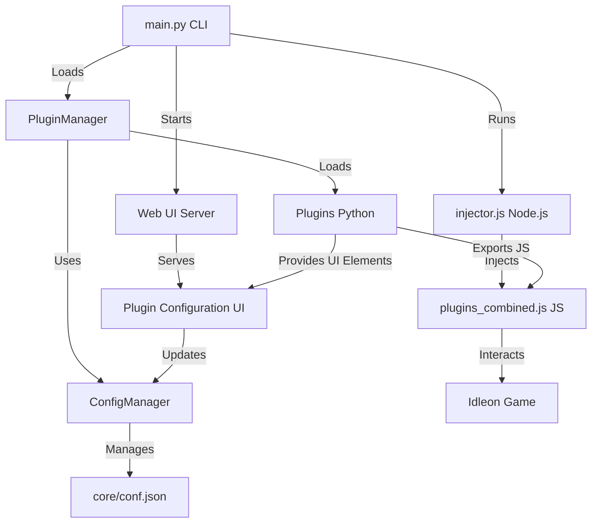

# IdleonWeb Python Launcher

A modern, extensible launcher and plugin system for automating and enhancing Legends of Idleon in the browser, powered by Python and Node.js.

---

## Features

- **Highly Extensible Plugin System:** Easily add, remove, or update features by writing Python plugins. Each plugin can inject custom JavaScript, automate gameplay, or add new commands to the CLI.
- **Modern Web UI:** Beautiful, responsive web interface for plugin configuration with real-time updates, autocomplete, and dynamic UI elements.
- **Centralized Configuration Management:** All configuration is managed through a global, atomic ConfigManager, ensuring consistency and easy access for both core and plugins. Supports granular path-based access and automatic persistence.
- **Rich CLI:** Interactive command-line interface with autocompletion, help, and plugin command discovery. All plugin commands are automatically exposed in the CLI.
- **Automatic Dependency Management:** Installs Node.js dependencies on first run.
- **Chromium/Chrome Automation:** Launches and controls Idleon in a browser with Chrome DevTools Protocol.
- **Single JS Injection:** All plugin JS is merged and injected into the main game context (N.js) for maximum compatibility.
- **Easy Plugin Development:** Add new plugins by dropping Python files in the `plugins/` directory. Plugins are hot-reloadable and can react to configuration changes.
- **Cross-Platform Compatibility:** Works seamlessly on Windows, Linux, and macOS with platform-specific setup scripts.

---

## Architecture Overview

IdleonWeb is designed for modularity and extensibility. The core components interact as follows:



*See below for more details on each component.*

- **main.py**: Entry point, provides the CLI, manages plugin loading, configuration, and launches the injector and web UI server.
- **PluginManager**: Loads and manages all plugins, handles lifecycle events, and exposes plugin commands to the CLI and web UI.
- **Plugins**: Python classes that can define CLI commands, export JavaScript, and provide UI elements for web configuration.
- **ConfigManager**: Singleton for all configuration, providing atomic get/set operations and automatic saving to `core/conf.json`.
- **injector.js**: Node.js script that launches Chromium, intercepts the game's JS, and injects the combined plugin code.
- **plugins_combined.js**: All plugin JS exports are merged here and injected into the game context.
- **Web UI Server**: Serves a modern web interface for plugin configuration with real-time updates and dynamic UI elements.

---

## Configuration and Extensibility

- **Centralized Config:** All configuration (global and per-plugin) is stored in `core/conf.json` and managed by the ConfigManager singleton. Plugins and core code use `config_manager.get_path()` and `set_path()` for atomic, path-based access.
- **Plugin Config:** Each plugin can define and react to its own config section. Config changes are automatically propagated to the browser, plugin instances, and web UI.
- **Dynamic Plugins:** Add new features by simply dropping a Python file in `plugins/`. Plugins can:
  - Expose CLI commands with `@plugin_command`
  - Export JavaScript with `@js_export`
  - Provide UI elements with `@ui_toggle`, `@ui_button`, `@ui_autocomplete_input`, etc.
  - React to config changes and game events
- **Hot Reload:** Plugins can be reloaded and reconfigured at runtime without restarting the application.
- **Web UI Integration:** All plugin UI elements are automatically available in the web interface with real-time updates.

---

## How It Works

### main.py (Python CLI)
- Loads configuration and plugins using the ConfigManager and PluginManager.
- Provides an interactive CLI for running plugin commands, viewing config, and managing plugins.
- Runs the Node.js injector to launch the browser and inject plugin code.
- Starts the web UI server for plugin configuration interface.
- Handles plugin lifecycle: initialization, updates, config changes, and cleanup.

### injector.js (Node.js)
- Launches Chromium/Chrome with a custom user profile and remote debugging enabled.
- Intercepts the game's main JS file (N.js), injects the combined plugin JS and core setup code.
- Waits for the game to be fully loaded and ready before injecting plugins.
- Ensures all plugin JS is available in the game context for use by plugins and the CLI.

### Web UI Server
- Serves a modern, responsive web interface at `http://localhost:8080`
- Provides real-time plugin configuration with dynamic UI elements
- Supports autocomplete, search results, and interactive controls
- Automatically updates when plugin configurations change

---

## Setup

### Quick Setup (Recommended)

#### Linux/macOS
Run the automated setup script:
```sh
./setup.sh
```

#### Windows
Run the automated setup script:
```cmd
setup.bat
```

The setup scripts will:
- Check for Python 3 and Node.js installations
- Create and configure the Python virtual environment
- Install all Python dependencies from `requirements.txt`
- Install Node.js dependencies in the `core/` directory
- Create necessary directories (`plugins/`, `core/tmp_js/`)
- Generate initial configuration file (`core/conf.json`)

### Manual Setup
If you prefer manual setup:

1. **Clone the repository and enter the directory:**
   ```sh
   git clone <repo-url>
   cd IdleonWeb
   ```

2. **Create and activate a Python virtual environment:**

   **Linux/macOS:**
   ```sh
   python3 -m venv .venv
   source .venv/bin/activate
   pip install -r requirements.txt
   ```

   **Windows:**
   ```cmd
   python -m venv .venv
   .venv\Scripts\activate
   pip install -r requirements.txt
   ```

3. **Install Node.js dependencies:**
   ```sh
   cd core
   npm install
   cd ..
   ```

4. **Run the launcher:**
   ```sh
   python main.py
   ```

---

## Plugin System Overview

- **Plugins are Python classes** in the `plugins/` directory, using the `@plugin_command` decorator to expose commands to the CLI.
- **Each plugin can export JavaScript** to be injected into Idleon via the browser.
- **All plugin JS is merged** into `core/plugins_combined.js` and injected into the game context by intercepting N.js.
- **Plugin commands** are accessed in the CLI as `plugins.pluginname.command`.
- **Plugins can react to config changes and game events** via lifecycle hooks.

---

## Usage

### CLI Interface
- **Start the CLI:**
  ```sh
  python main.py
  ```
- **Autocomplete:** Use Tab to discover commands and plugin functions.
- **Run a plugin command:**
  ```sh
  plugins.myplugin.hello "Hello world"
  ```
- **Show help:**
  ```sh
  help
  help plugins.myplugin.hello
  ```
- **Exit:**
  ```sh
  exit
  ```

### Web Interface
- **Access the web UI:** After running `inject` or `web_ui`, open `http://localhost:8080`
- **Plugin Configuration:** Use the web interface to configure plugins with real-time updates
- **Interactive Controls:** Toggle switches, sliders, buttons, and autocomplete inputs
- **Search and Filter:** Use search functionality to find items and filter results
- **Responsive Design:** Works on desktop and mobile devices

---

## Writing Your Own Plugin

1. **Create a new Python file in `plugins/`** (e.g., `myplugin.py`).
2. **Define a class inheriting from `PluginBase`.**
3. **Use `@plugin_command` to expose CLI commands.**
4. **Use `@js_export` to define JS functions to inject.**
5. **Use UI decorators to create web interface elements:**
   - `@ui_toggle` - Toggle switches
   - `@ui_button` - Action buttons
   - `@ui_autocomplete_input` - Input with autocomplete
   - `@ui_search_with_results` - Search with results display
   - `@ui_slider` - Range sliders
   - `@ui_select` - Dropdown selections
6. **Reload the CLI to see your plugin and commands.**
7. **Access your plugin's UI in the web interface at `http://localhost:8080`.**

### Plugin Lifecycle Hooks

When creating a plugin, you can override the following methods from `PluginBase` to control its behavior. **Note: The following methods are required to be defined in your plugin class (they are abstract):**

- `cleanup(self)`: Called when the plugin is unloaded or the application exits. Use this to clean up resources.
- `update(self)`: Called periodically (every second) while the injector is running. Use for polling or background tasks.
- `on_config_changed(self, config)`: Called whenever the plugin's configuration changes. Use to react to config updates.
- `on_game_ready(self)`: Called when the Idleon game is fully loaded and ready. Use to perform actions that require the game context.

You may also optionally override `initialize(self, injector)` to perform setup when the plugin is loaded, but it is not required.

## UI Decorators and Naming Conventions

### Available UI Decorators

- **`@ui_toggle`** - Toggle switches for boolean values
- **`@ui_button`** - Action buttons that execute functions
- **`@ui_slider`** - Range sliders for numeric values
- **`@ui_select`** - Dropdown selections
- **`@ui_text_input`** - Text input fields
- **`@ui_number_input`** - Numeric input fields
- **`@ui_input_with_button`** - Input field with execute button
- **`@ui_search_with_results`** - Search input with results display
- **`@ui_autocomplete_input`** - Input with autocomplete suggestions

### Autocomplete Naming Convention

For any UI element named `{element_name}_ui`, the system automatically looks for a corresponding autocomplete function named `get_{element_name}_autocomplete`.

**Example:**
- UI Element: `spawn_item_ui` → Element name: `spawn_item`
- Autocomplete Function: `get_spawn_autocomplete` → Matches pattern `get_{element_name}_autocomplete`

### Complete Plugin Example

```python
from plugin_system import (
    PluginBase, plugin_command, js_export, 
    ui_toggle, ui_button, ui_slider, ui_select, 
    ui_text_input, ui_number_input, ui_input_with_button,
    ui_search_with_results, ui_autocomplete_input
)
from config_manager import config_manager

class ExamplePlugin(PluginBase):
    VERSION = "1.0.0"
    DESCRIPTION = "Example plugin demonstrating all UI elements"

    def __init__(self, config=None):
        super().__init__(config or {})
        self.injector = None
        self.name = 'example_plugin'
        self.debug = config_manager.get_path('plugin_configs.example_plugin.debug', False)

    # Required lifecycle methods
    async def cleanup(self):
        if self.debug:
            console.print(f"[ExamplePlugin] Cleaning up resources")

    async def update(self):
        # Periodic updates (called every second)
        pass

    async def on_config_changed(self, config):
        if self.debug:
            console.print(f"[ExamplePlugin] Config changed: {config}")
        if hasattr(self, 'injector') and self.injector:
            self.set_config(config)

    async def on_game_ready(self):
        if self.debug:
            console.print(f"[ExamplePlugin] Game is ready, setting up features")

    # UI Elements Examples

    @ui_toggle(
        label="Enable Feature",
        description="Toggle the main feature on/off",
        config_key="enabled",
        default_value=True,
        category="General Settings",
        order=1
    )
    async def enable_feature_ui(self, value: bool = None):
        if value is not None:
            self.config["enabled"] = value
            self.save_to_global_config()
        return f"Feature {'enabled' if self.config.get('enabled', True) else 'disabled'}"

    @ui_slider(
        label="Speed Multiplier",
        description="Adjust the speed multiplier (1-10x)",
        config_key="speed_multiplier",
        default_value=2,
        min_value=1,
        max_value=10,
        step=0.5,
        category="Performance",
        order=1
    )
    async def speed_multiplier_ui(self, value: float = None):
        if value is not None:
            self.config["speed_multiplier"] = value
            self.save_to_global_config()
        return f"Speed multiplier set to {self.config.get('speed_multiplier', 2)}x"

    @ui_select(
        label="Target Mode",
        description="Select the targeting mode",
        config_key="target_mode",
        default_value="auto",
        options=[
            {"label": "Automatic", "value": "auto"},
            {"label": "Manual", "value": "manual"},
            {"label": "Smart", "value": "smart"}
        ],
        category="Targeting",
        order=1
    )
    async def target_mode_ui(self, value: str = None):
        if value is not None:
            self.config["target_mode"] = value
            self.save_to_global_config()
        return f"Target mode: {self.config.get('target_mode', 'auto')}"

    @ui_text_input(
        label="Custom Message",
        description="Enter a custom message to display",
        config_key="custom_message",
        default_value="Hello World",
        placeholder="Enter your message here",
        required=True,
        category="Customization",
        order=1
    )
    async def custom_message_ui(self, value: str = None):
        if value is not None:
            self.config["custom_message"] = value
            self.save_to_global_config()
        return f"Message set to: {self.config.get('custom_message', 'Hello World')}"

    @ui_number_input(
        label="Item Count",
        description="Number of items to process",
        config_key="item_count",
        default_value=10,
        min_value=1,
        max_value=1000,
        step=1,
        category="Items",
        order=1
    )
    async def item_count_ui(self, value: int = None):
        if value is not None:
            self.config["item_count"] = value
            self.save_to_global_config()
        return f"Item count: {self.config.get('item_count', 10)}"

    @ui_button(
        label="Test Connection",
        description="Test the connection to the game",
        category="Actions",
        order=1
    )
    async def test_connection_ui(self):
        if hasattr(self, 'injector') and self.injector:
            try:
                result = self.run_js_export('test_connection_js', self.injector)
                return f"SUCCESS: Connection test - {result}"
            except Exception as e:
                return f"ERROR: Connection test failed - {str(e)}"
        else:
            return "ERROR: No injector available - run 'inject' first"

    @ui_input_with_button(
        label="Execute Command",
        description="Execute a custom command",
        button_text="Execute",
        placeholder="Enter command (e.g. 'spawn Copper 5')",
        category="Commands",
        order=1
    )
    async def execute_command_ui(self, value: str = None):
        if value and hasattr(self, 'injector') and self.injector:
            try:
                result = self.run_js_export('execute_command_js', self.injector, command=value)
                return f"SUCCESS: {result}"
            except Exception as e:
                return f"ERROR: {str(e)}"
        return "Enter a command to execute"

    @ui_search_with_results(
        label="Search Items",
        description="Search for items in the game",
        button_text="Search",
        placeholder="Enter search term (e.g. 'Copper', 'Sword')",
        category="Search",
        order=1
    )
    async def search_items_ui(self, value: str = None):
        if hasattr(self, 'injector') and self.injector:
            try:
                if value and value.strip():
                    result = self.run_js_export('search_items_js', self.injector, query=value.strip())
                    return result
                else:
                    return "Please enter a search term"
            except Exception as e:
                return f"ERROR: Search failed - {str(e)}"
        else:
            return "ERROR: No injector available - run 'inject' first"

    @ui_autocomplete_input(
        label="Spawn Item",
        description="Spawn an item with autocomplete",
        button_text="Spawn",
        placeholder="Item name (e.g. Copper, Sword)",
        category="Spawn",
        order=1
    )
    async def spawn_item_ui(self, value: str = None):
        if value and hasattr(self, 'injector') and self.injector:
            try:
                result = self.run_js_export('spawn_item_js', self.injector, item=value)
                return f"SUCCESS: {result}"
            except Exception as e:
                return f"ERROR: {str(e)}"
        return "Enter item name to spawn"

    # Autocomplete function (follows naming convention)
    async def get_spawn_autocomplete(self, query: str = ""):
        """Autocomplete function for spawn_item_ui"""
        if not hasattr(self, 'injector') or not self.injector:
            return []
        
        try:
            # Get item list from game
            result = self.run_js_export('get_item_list_js', self.injector)
            if result and not result.startswith("Error:"):
                items = result.split('\n')
                suggestions = []
                query_lower = query.lower()
                
                for item in items:
                    if query_lower in item.lower():
                        suggestions.append(item.split(' : ')[0] if ' : ' in item else item)
                
                return suggestions[:10]  # Limit to 10 suggestions
            return []
        except Exception as e:
            return []

    # CLI Commands
    @plugin_command(
        help="Test the plugin connection",
        params=[],
    )
    async def test_connection(self, injector=None, **kwargs):
        if self.debug:
            console.print(f"[ExamplePlugin] Testing connection...")
        return self.run_js_export('test_connection_js', injector)

    @plugin_command(
        help="Execute a custom command",
        params=[
            {"name": "command", "type": str, "help": "Command to execute"},
        ],
    )
    async def execute_command(self, command: str, injector=None, **kwargs):
        if self.debug:
            console.print(f"[ExamplePlugin] Executing command: {command}")
        return self.run_js_export('execute_command_js', injector, command=command)

    # JavaScript Exports
    @js_export()
    def test_connection_js(self):
        return '''
        try {
            const ctx = window.__idleon_cheats__;
            if (ctx && ctx["com.stencyl.Engine"]) {
                return "Game connection successful";
            } else {
                return "Game not ready";
            }
        } catch (e) {
            return `Error: ${e.message}`;
        }
        '''

    @js_export(params=["command"])
    def execute_command_js(self, command=None):
        return f'''
        try {{
            console.log("Executing command: {command}");
            return "Command executed successfully";
        }} catch (e) {{
            return `Error: ${{e.message}}`;
        }}
        '''

    @js_export(params=["query"])
    def search_items_js(self, query=None):
        return f'''
        try {{
            const ctx = window.__idleon_cheats__;
            const itemDefs = ctx["com.stencyl.Engine"].engine.getGameAttribute("ItemDefinitionsGET").h;
            const q = "{query}".toLowerCase();
            
            const matches = Object.entries(itemDefs).filter(([id, def]) => {{
                const name = def?.h?.displayName || '';
                return id.toLowerCase().includes(q) || name.toLowerCase().includes(q);
            }});
            
            return matches.length 
                ? matches.map(([id, def]) => `${{id}} : ${{def?.h?.displayName?.replace(/_/g, ' ') || id}}`).join("\\n")
                : `No items found for: {query}`;
        }} catch (e) {{
            return `Error: ${{e.message}}`;
        }}
        '''

    @js_export(params=["item"])
    def spawn_item_js(self, item=None):
        return f'''
        try {{
            const ctx = window.__idleon_cheats__;
            const engine = ctx["com.stencyl.Engine"].engine;
            const itemDefs = engine.getGameAttribute("ItemDefinitionsGET").h;
            
            const itemDef = itemDefs["{item}"];
            if (!itemDef) return `No item found: '{{item}}'`;
            
            console.log(`Spawning item: ${{itemDef.h.displayName}}`);
            return `Spawned ${{itemDef.h.displayName}}`;
        }} catch (e) {{
            return `Error: ${{e.message}}`;
        }}
        '''

    @js_export()
    def get_item_list_js(self):
        return '''
        try {
            const ctx = window.__idleon_cheats__;
            const itemDefs = ctx["com.stencyl.Engine"].engine.getGameAttribute("ItemDefinitionsGET").h;
            
            return Object.entries(itemDefs)
                .map(([id, def]) => `${id} : ${def?.h?.displayName?.replace(/_/g, ' ') || id}`)
                .join("\\n");
        } catch (e) {
            return `Error: ${e.message}`;
        }
        '''

plugin_class = ExamplePlugin
```

### UI Decorator Parameters

Each UI decorator accepts the following common parameters:

- **`label`** - Display name for the UI element
- **`description`** - Help text shown below the element
- **`category`** - Groups elements in the web UI (e.g., "General Settings", "Actions")
- **`order`** - Display order within the category (lower numbers appear first)

#### Element-Specific Parameters

**`@ui_toggle`:**
- `config_key` - Key in plugin config to bind to
- `default_value` - Initial boolean value (True/False)

**`@ui_slider`:**
- `config_key` - Key in plugin config to bind to
- `default_value` - Initial numeric value
- `min_value` - Minimum allowed value
- `max_value` - Maximum allowed value
- `step` - Step increment for the slider

**`@ui_select`:**
- `config_key` - Key in plugin config to bind to
- `default_value` - Initial selected value
- `options` - List of option dictionaries with `label` and `value`

**`@ui_text_input` / `@ui_number_input`:**
- `config_key` - Key in plugin config to bind to
- `default_value` - Initial text/numeric value
- `placeholder` - Placeholder text shown when empty
- `required` - Whether the field is required (boolean)

**`@ui_button`:**
- No additional parameters (just executes the function)

**`@ui_input_with_button`:**
- `button_text` - Text shown on the button
- `placeholder` - Placeholder text for the input field

**`@ui_search_with_results`:**
- `button_text` - Text shown on the search button
- `placeholder` - Placeholder text for the search field

**`@ui_autocomplete_input`:**
- `button_text` - Text shown on the execute button
- `placeholder` - Placeholder text for the input field

### Best Practices

1. **Naming Convention**: Always end UI element functions with `_ui` (e.g., `spawn_item_ui`)
2. **Autocomplete Functions**: Follow the pattern `get_{element_name}_autocomplete` for autocomplete inputs
3. **Config Keys**: Use descriptive config keys that match your plugin's functionality
4. **Categories**: Group related elements in the same category for better organization
5. **Error Handling**: Always check for injector availability and handle errors gracefully
6. **Return Values**: Return descriptive success/error messages for user feedback
7. **Debug Mode**: Use the plugin's debug flag for conditional logging

---

## Troubleshooting

- **Node.js not found?** Ensure Node.js and npm are installed and in your PATH.
- **Chromium/Chrome not found?** The injector tries common install locations. Install Chromium or Google Chrome if needed.
- **Plugin not showing up?** Check for syntax errors and ensure your plugin class is named and exported correctly.
- **Web UI not accessible?** Ensure the web server is running and check `http://localhost:8080`.
- **UI elements not appearing?** Make sure your plugin uses the correct UI decorators and the web server is started.
- **Debug output:** Set `"debug": true` in `core/conf.json` for verbose logs.

---

## Project Structure

```
IdleonWeb/
├── core/
│   ├── injector.js          # Node.js browser automation
│   ├── core.js              # Game integration utilities
│   ├── plugins_combined.js  # Merged plugin JavaScript
│   ├── conf.json           # Configuration file
│   └── package.json        # Node.js dependencies
├── webui/
│   ├── web_api_integration.py  # Web server and API
│   ├── web_ui_generator.py     # UI generation utilities
│   └── templates/
│       ├── css/
│       │   └── styles.css      # Web UI styling
│       ├── js/
│       │   └── plugin-ui.js    # Frontend JavaScript
│       └── html/
│           ├── base.html        # Base template
│           ├── plugin_cards.html # Single plugin layout
│           ├── tabbed_interface.html # Multi-plugin layout
│           └── ui_elements.html # UI element templates
├── plugins/
│   ├── spawn_item.py           # Item spawning plugin
│   ├── instant_mob_respawn.py  # Mob respawn plugin
│   └── ...                     # Additional plugins
├── main.py                     # CLI entry point
├── plugin_system.py            # Plugin management system
├── config_manager.py           # Configuration management
├── setup.sh                    # Linux/macOS setup script
├── setup.bat                   # Windows setup script
├── requirements.txt            # Python dependencies
└── README.md                   # This file
```

---

## Credits

This project was inspired by and builds upon the excellent work of the original [Idleon-Injector](https://github.com/MrJoiny/Idleon-Injector) project by [@MrJoiny](https://github.com/MrJoiny). The original injector demonstrated the core concepts of browser automation and script injection for Legends of Idleon, which served as the foundation for this Python-based plugin system.

Key inspirations from the original project:
- Browser automation using Chrome DevTools Protocol
- Script interception and injection techniques
- Game context detection and integration
- Cross-platform compatibility approaches

This project extends those concepts with:
- Modern Python-based plugin architecture
- Web UI for plugin configuration
- Enhanced CLI with autocompletion
- Centralized configuration management
- Real-time plugin development workflow

---

## License
MIT 