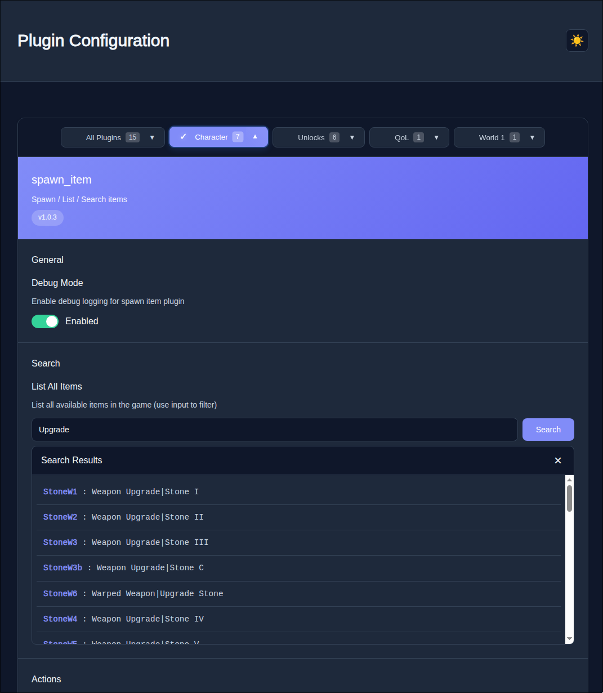
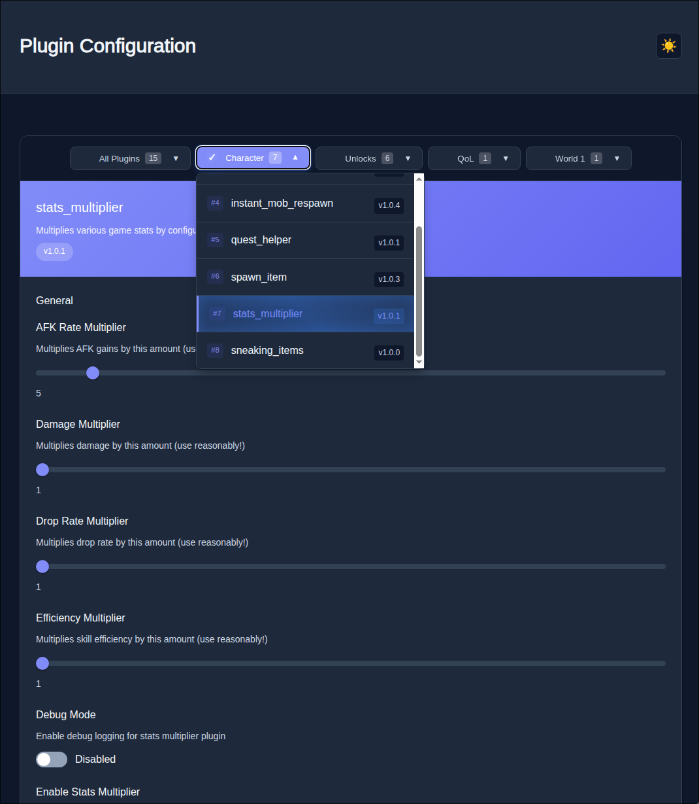
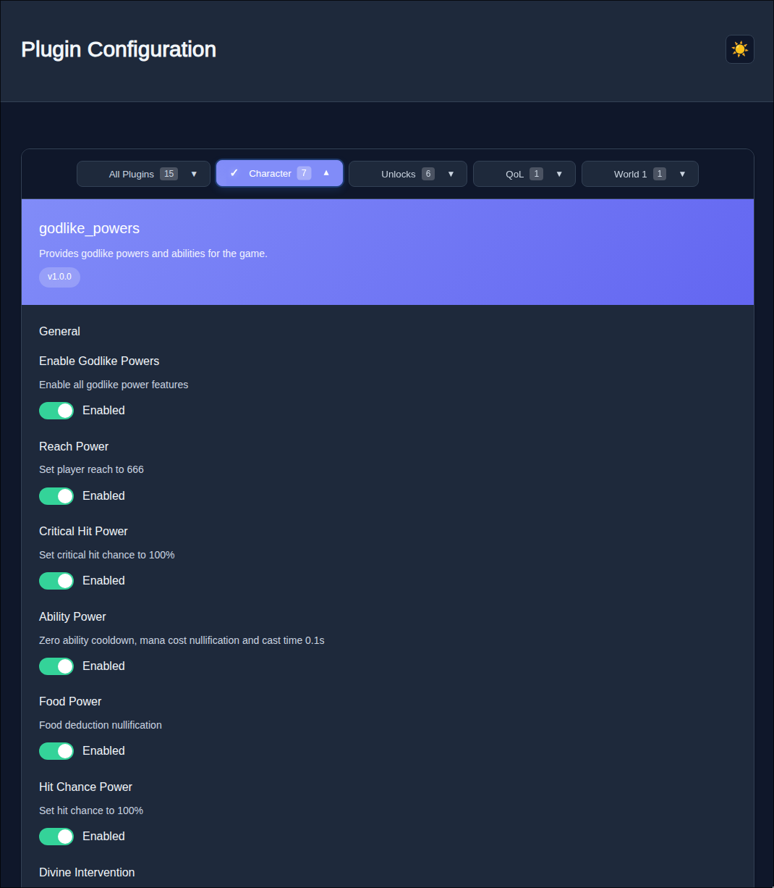
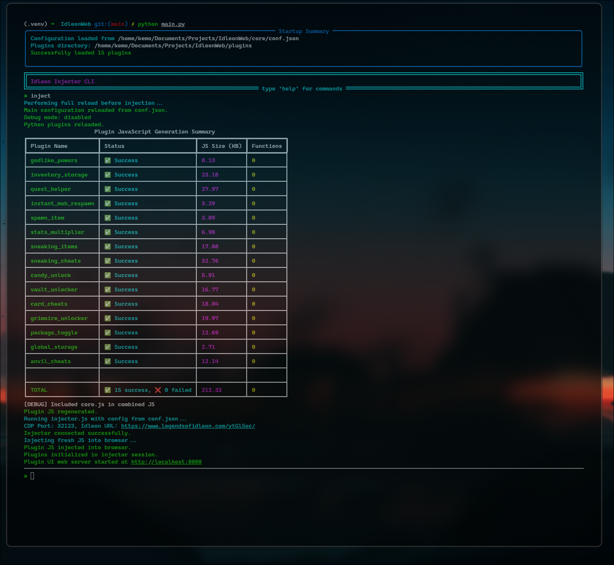

# IdleonWeb

[](https://www.python.org/)
[](https://nodejs.org/)
[](LICENSE)
[](https://github.com/xi-ve/IdleonWeb)
[](https://github.com/xi-ve/IdleonWeb/actions/workflows/combined-tests-and-release.yml)

A modern, user-friendly launcher and plugin system for enhancing Legends of Idleon with a beautiful web interface.

> **For developers:** See [PLUGIN_QUICKSTART.md](PLUGIN_QUICKSTART.md) for a quick guide to creating plugins, or [DEVELOPMENT.md](DEVELOPMENT.md) for detailed technical documentation.

<details>
  <summary><strong>Screenshots (click to expand)</strong></summary>

  <p align="center">
    
    <br/>
    
    <br/>
    
    <br/>
    
  </p>
</details>

## Features

- **Easy-to-Use Web Interface** - Configure plugins and manage game enhancements through a modern web browser
- **Plugin System** - Add new features by simply dropping plugin files into the `plugins/` folder
- **Real-Time Updates** - See changes instantly as you configure plugins
- **Cross-Platform** - Works on Windows, Linux, and macOS
- **One-Click Setup** - Automated installation scripts for all platforms
- **Plugin Categories** - Organized plugin management with categories like Character, QoL, Unlocks, and World-specific
- **Folderized Plugins** - Support for organizing plugins in subdirectories for better organization

---

## Quick Start

### Option 1: Pre-compiled Binaries (Easiest) ⭐

**Download and run - no setup required!**

1. Go to the [Releases page](https://github.com/xi-ve/IdleonWeb/releases)
2. Download the appropriate file for your system:
   - 🐧 **Linux**: `IdleonWeb-linux-v{version}.tar.gz`
   - 🪟 **Windows**: `IdleonWeb-windows-v{version}.zip` 
   - 🍎 **macOS**: `IdleonWeb-macos-v{version}.tar.gz`
3. Extract the archive to a folder
4. **Install Node.js** (required): [Download Node.js](https://nodejs.org/en/download/) - Get the LTS version
5. Run the executable:
   - **Linux/macOS**: `./IdleonWeb`
   - **Windows**: `IdleonWeb.exe`
6. Node.js dependencies will install automatically on first run
7. Open `http://localhost:8080` in your browser to configure plugins

**Requirements:**
- Node.js must be installed on your system
- No Python or manual setup required!

---

### Option 2: Manual Setup (From Source)

**For developers or if pre-compiled binaries are unavailable for your platform.**

#### Windows Setup (if dependencies are missing)
If you don't have Python or Node.js installed, download and install them first:

**Required Downloads:**
- **Python 3.8+**: [Download Python](https://www.python.org/downloads/windows/) - Get the latest stable version
- **Node.js 22+**: [Download Node.js](https://nodejs.org/en/download/) - Get the LTS (Long Term Support) version

**Installation Steps:**
1. Install Python (make sure to check "Add Python to PATH" during installation)
2. Install Node.js (use default settings)
3. Open Command Prompt (cmd.exe) or PowerShell as Administrator
4. Verify installations by running:
   ```cmd
   python --version
   node --version
   ```
5. If commands are not recognized, restart your terminal and try again
6. Follow the Universal Setup steps below

#### Universal Setup (Recommended for source installations)
1. Download and extract the IdleonWeb source files to a folder
2. Open your terminal:
   - **Windows**: Open Command Prompt (cmd.exe) or PowerShell
   - **Linux**: Open Terminal
3. Navigate to the IdleonWeb folder:
   ```bash
   cd path/to/IdleonWeb
   ```
4. Install dependencies:
   ```bash
   python setup.py
   ```
5. Start the launcher:
   ```bash
   python launch.py
   ```
6. The application will automatically discover available plugins and ask if you want to enable them
7. Auto-injection will run automatically (enabled by default) - the game will launch with enhancements
8. Open `http://localhost:8080` in your browser to configure plugins

---

## How to Use

### Starting the Launcher
```bash
python launch.py
```

### Launching the Game
**Automatic Mode (Default):**
- The game will launch automatically after plugin discovery
- Auto-injection runs immediately when the launcher starts
- To disable: use the `auto_inject off` command

**Manual Mode:**
1. Disable auto-injection: `auto_inject off`
2. In the launcher, type `inject` and press Enter
3. The game will open in a browser window

### Configuration
1. Open `http://localhost:8080` in your browser
2. Configure your plugins using the web interface
3. Changes take effect immediately

> **Note:** On first launch, if the game requires you to log in, the injection process may fail. Simply close the browser, then run the `inject` command again in the launcher after logging in. This is normal for the first run.

### Web Interface
- **Plugin Configuration** - Toggle features on/off, adjust settings
- **Real-Time Updates** - See changes immediately
- **Search & Filter** - Find items and manage game data
- **Mobile Friendly** - Works on phones and tablets
- **Categorized Interface** - Browse plugins by category (Character, QoL, Unlocks, World-specific)
- **Visual Feedback** - Shimmer effects and visual indicators for selected plugins

---

## Available Plugins

### Character Plugins
- **Currency Cheats** - Comprehensive currency management for Idleon: gems, coins, tokens, and all other currencies with display, add, set, and max functions
- **Godlike Powers** - Provides godlike powers and abilities for the game
- **Instant Mob Respawn** - Change the rates of the game
- **Inventory Storage** - Automatically unlock all inventory packages and storage spaces
- **⚠️ Quest Manager** - Comprehensive quest management system to view, unlock, and manage all quests. Provides status overview, individual quest unlocking with autocomplete, and quest reset functionality. ⚠️ MODERATE RISK: Use with caution as quest manipulation can affect game progression
- **Spawn Item** - Spawn / List / Search items with autocomplete functionality
- **Stats Multiplier** - Multiplies various game stats by configurable amounts

### QoL (Quality of Life) Plugins
- **Global Storage** - Provides global storage functionality

### Unlocks Plugins
- **Candy Unlock** - Allows the use of Time Candy anywhere, bypassing all map restrictions, dark places, and activity-specific blocks like Cooking/Laboratory
- **Card Cheats** - Comprehensive card system cheats: search, unlock, level management, stats viewer, and complete card collection tools
- **⚠️ Class Unlock** - Set characters to any class, change characters classes, view class progression. ⚠️ DANGER: Class changes can corrupt your character (infinite/invalid HP/MP/stats). Emergency recovery: Use 'Complete Class Redo Token' item
- **Grimoire Unlocker** - Unlock and manage grimoire upgrades for Death Bringer class
- **Package Toggle** - Toggle bought packages and bundles
- **Vault Unlocker** - Unlock and manage vault upgrades with category-based controls

### World-Specific Plugins
#### World 1
- **Anvil Cheats** - Cheats for World 1 - Anvil and Smithing related
- **⚠️ Stamp Cheats** - Unlock and manage stamp upgrades & bribes. Includes stamp viewing, leveling, unlocking, and bribe purchasing tools. ⚠️ Use with caution as stamps and bribes affect multiple game systems!

#### World 2
- **Post Office Cheats** - Post Office cheats - complete orders and manage upgrades with detailed status

#### World 6
- **⚠️ Sneaking Cheats** - Comprehensive cheats for the sneaking game including money, unlocks, upgrades, and more. ⚠️ HIGH RISK: These features may brick your account as the sneaking game data structure is complex and not fully explored. Use at your own risk!
- **⚠️ Sneaking Items** - Comprehensive item cheats for the sneaking game including hats, weapons, gloves, and charms. ⚠️ HIGH RISK: These features may brick your account as the sneaking game data structure is complex and not fully explored. Use at your own risk!

---

## Project Structure

```
IdleonWeb/
├── plugins/           # Plugin files (add your own here)
│   ├── character/     # Character-related plugins
│   ├── qol/          # Quality of Life plugins
│   ├── unlocks/      # Unlock-related plugins
│   ├── world1/       # World 1 specific plugins
│   ├── world2/       # World 2 specific plugins
│   ├── world6/       # World 6 specific plugins
│   └── ...           # Additional plugin categories
├── core/             # Core system files
├── webui/            # Web interface files
├── build_process/    # Build scripts for standalone executables
├── .github/workflows/# Automated CI/CD for multi-platform builds
├── integration_tests/# Automated testing suite
├── main.py           # Main launcher
├── setup.py          # Universal setup script
└── README.md         # This file
```

### Automated Builds

This project features automated multi-platform builds via GitHub Actions:
- **Integration Tests**: All platforms tested on every commit
- **Native Builds**: Linux, Windows, and macOS executables built automatically
- **Releases**: Triggered on successful tests, includes all platform binaries
- **Quality Assurance**: Only tested code reaches releases

---

## Troubleshooting

### Common Issues

**Pre-compiled Binary Issues:**
- **"Node.js not found"**: Install Node.js from [nodejs.org](https://nodejs.org/) and restart the executable
- **"Permission denied" (Linux/macOS)**: Run `chmod +x IdleonWeb` to make the file executable
- **Dependencies installing slowly**: This is normal on first run, subsequent starts will be faster
- **Binary won't start**: Try downloading the source code and using manual setup instead

**General Issues:**
- **Game doesn't launch?**
  - Make sure you have Chrome or Chromium installed
  - Try running `inject` again after a few seconds

- **Web interface not loading?**
  - Check that the launcher shows "Plugin UI web server started"
  - Try refreshing the browser page

- **Plugins not working?**
  - Ensure you typed `inject` in the launcher
  - Check the browser console for error messages

**Setup fails?**
- Make sure Python 3.8+ and Node.js are installed (for manual setup)
- Try running `python setup.py` - it can automatically install missing dependencies using package managers
- Run as administrator if needed (Windows)
- Consider using pre-compiled binaries instead

### Getting Help

- Check the browser console for error messages
- Look for red error messages in the launcher
- Ensure all dependencies are properly installed

---

## Plugin Development

Want to create your own plugins? It's easy!

### Quick Start
1. Copy the example plugin: `cp plugins/example_plugin.py plugins/my_plugin.py`
2. Edit your plugin file
3. Add UI elements with decorators like `@ui_toggle`, `@ui_button`, `@ui_slider`
4. Add JavaScript code with `@js_export`
5. Test your plugin in the web UI

See [PLUGIN_QUICKSTART.md](PLUGIN_QUICKSTART.md) for a complete guide with examples!

### Available UI Elements
- **Toggles** - On/off switches
- **Buttons** - Action buttons
- **Sliders** - Range controls
- **Text Inputs** - Text fields
- **Search** - Search with results
- **Autocomplete** - Input with suggestions

### Plugin Categories
Plugins can be organized into categories by setting the `CATEGORY` attribute:
- `"Character"` - Character-related features
- `"QoL"` - Quality of Life improvements
- `"Unlocks"` - Unlock-related features
- `"World 1"`, `"World 2"`, etc. - World-specific features

### Plugin Ordering
Set the `PLUGIN_ORDER` attribute to control the display order in the UI (lower numbers appear first).

## Contributing

Want to add new features or fix bugs? See [DEVELOPMENT.md](DEVELOPMENT.md) for:

- Plugin development guide
- Architecture documentation
- Technical setup instructions
- Code contribution guidelines

---

## License

MIT License - see [LICENSE](LICENSE) file for details.

---

## Credits

This project was inspired by and builds upon the excellent work of the original [Idleon-Injector](https://github.com/MrJoiny/Idleon-Injector) project by [@MrJoiny](https://github.com/MrJoiny). The original injector demonstrated the core concepts of browser automation and script injection for Legends of Idleon, which served as the foundation for this Python-based plugin system.

Key inspirations from the original project:
- Browser automation using Chrome DevTools Protocol
- Script interception and injection techniques
- Game context detection and integration
- Cross-platform compatibility approaches

This project extends those concepts with:
- Modern Python-based plugin architecture
- Web UI for plugin configuration
- Enhanced CLI with autocompletion
- Centralized configuration management
- Real-time plugin development workflow
- Categorized plugin organization
- Folderized plugin structure 