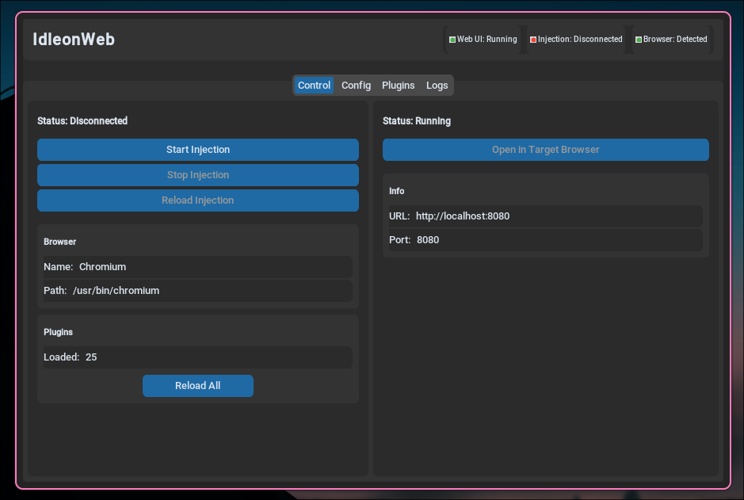
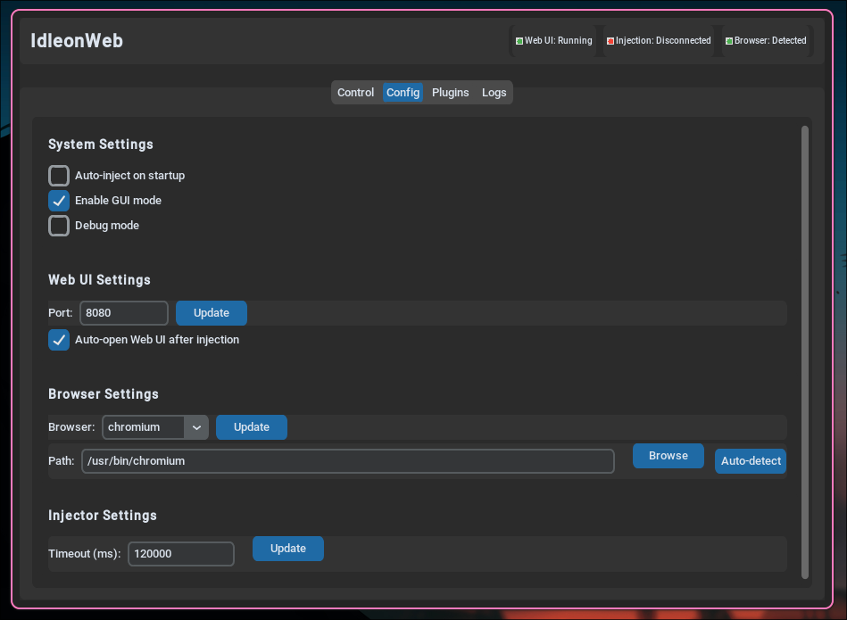
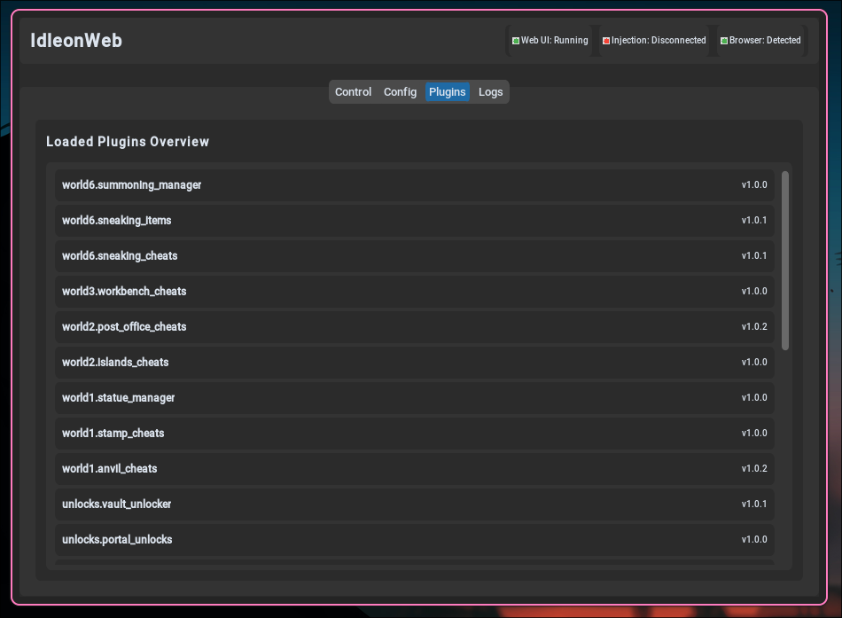
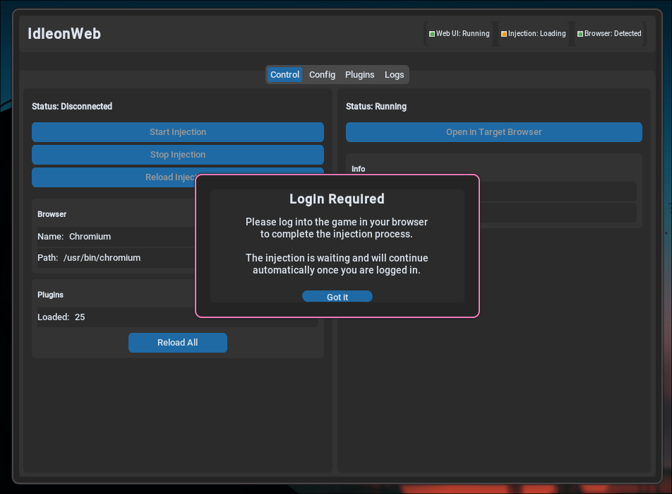
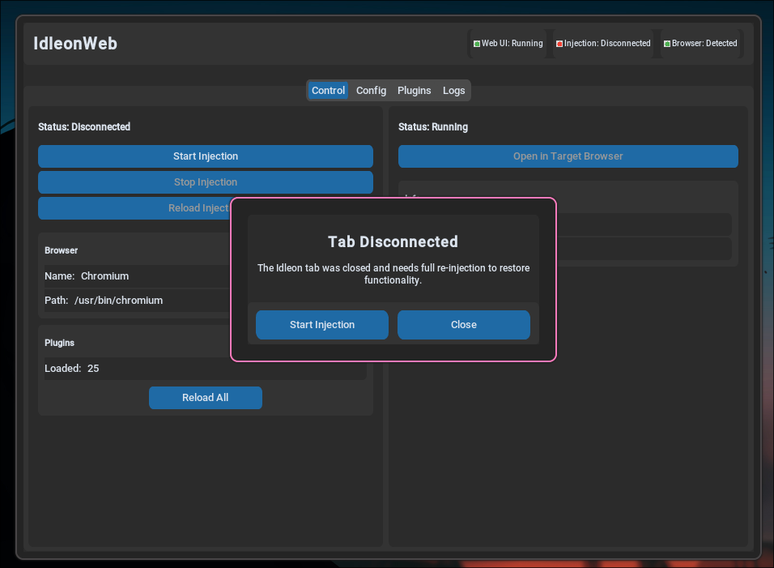

# IdleonWeb

[](https://www.python.org/)
[](https://nodejs.org/)
[](LICENSE)
[](https://github.com/xi-ve/IdleonWeb)
[](https://github.com/xi-ve/IdleonWeb/actions/workflows/combined-tests-and-release.yml)

A modern, user-friendly launcher and plugin system for enhancing Legends of Idleon with a beautiful web interface and intuitive GUI.

> **For developers:** See [PLUGIN_QUICKSTART.md](PLUGIN_QUICKSTART.md) for a quick guide to creating plugins, or [DEVELOPMENT.md](DEVELOPMENT.md) for detailed technical documentation.

## GUI Interface

<p align="center">
  
</p>

The new GUI provides a streamlined interface for managing plugins and configuring settings with an intuitive design that makes it easy to navigate and customize your Idleon experience.

<details>
  <summary><strong>Screenshots (click to expand)</strong></summary>

  <p align="center">
    
    <br/>
    
    <br/>
    
    <br/>
    <em>Note: GUI_Popup1.png shows an automatic reminder that appears to remind users that a login is needed in order for the cheat to work.</em>
    <br/>
    
    <br/>
    <em>Note: GUI_Popup2.png shows a popup that asks the user to start reinjection or close the popup if a tab was reloaded/closed or the browser was closed.</em>
    <br/>
    
    <br/>
    
    <br/>
    
    <br/>
    
  </p>
</details>

## Features

### For players
- **Modern GUI Interface**: Clean, intuitive desktop application with streamlined plugin management
- **Point‑and‑click UI**: Configure everything from a clean web page. No commands or code needed.
- **One‑click start**: Launch the game and inject automatically; no manual steps each time.
- **Popular cheats built‑in**: Portals, cards, statues, islands, post office, anvil, stamps, summoning, and more.
- **Clear categories**: Character, QoL, Unlocks, and World 1/2/3/6 collections for quick discovery.
- **Live feedback**: Changes apply immediately; status panels show current values.
- **Automatic reminders**: Built-in notifications remind users about login requirements and reinjection needs
- **Mobile friendly**: Works on phones and tablets.
- **Cross‑platform**: Windows, Linux, macOS.

### For developers
- **Simple plugin API**: Write Python plugins with decorators for UI (`@ui_toggle`, `@ui_button`, etc.).
- **Auto‑generated UI**: The web interface is built from your decorators—no frontend work required.
- **JS export bridge**: Attach JavaScript snippets with `@js_export`; they run inside the game context.
- **Live safety checks**: Built‑in Node.js syntax validation for exported JS before it’s sent to the game.
- **Hot discovery**: New plugins are found automatically; organize by folders and categories.
- **Structured config**: Centralized config manager with per‑plugin settings and persistence.

---

## Quick Start

### Option 1: Pre-compiled Binaries (Easiest)

**Download and run - no setup required!**

1. Go to the [Releases page](https://github.com/xi-ve/IdleonWeb/releases)
2. Download the appropriate file for your system:
   - Linux: `IdleonWeb-linux-v{version}.tar.gz`
   - Windows: `IdleonWeb-windows-v{version}.zip`
   - macOS (Apple Silicon): `IdleonWeb-macos-arm64-v{version}.tar.gz`
   - macOS (Intel): `IdleonWeb-macos-x86_64-v{version}.tar.gz`
3. Extract the archive to a folder
4. **Install Node.js v20** (required): [Download Node.js](https://nodejs.org/en/download/) - Get the LTS version
5. Run the executable:
   - **Linux/macOS**: `./IdleonWeb`
   - **Windows**: `IdleonWeb.exe`
6. No npm install is needed; dependencies are bundled in the executable
7. Open `http://localhost:8080` in your browser to configure plugins

Note (macOS): Choose arm64 for Apple Silicon (M1/M2/M3) Macs, x86_64 for Intel Macs.

**Requirements:**
- Node.js must be installed on your system
- No Python or manual setup required!

---

### Option 2: Manual Setup (From Source)

**For developers or if pre-compiled binaries are unavailable for your platform.**

#### Windows Setup (if dependencies are missing)
If you don't have Python or Node.js installed, download and install them first:

**Required Downloads:**
- **Python 3.8+**: [Download Python](https://www.python.org/downloads/windows/) - Get the latest stable version
- **Node.js v20+**: [Download Node.js](https://nodejs.org/en/download/) - Get the LTS (Long Term Support) version

**Installation Steps:**
1. Install Python (make sure to check "Add Python to PATH" during installation)
2. Install Node.js (use default settings)
3. Open Command Prompt (cmd.exe) or PowerShell as Administrator
4. Verify installations by running:
   ```cmd
   python --version
   node --version
   ```
5. If commands are not recognized, restart your terminal and try again
6. Follow the Universal Setup steps below

#### Universal Setup (Recommended for source installations)
1. Download and extract the IdleonWeb source files to a folder
2. Open your terminal:
   - **Windows**: Open Command Prompt (cmd.exe) or PowerShell
   - **Linux**: Open Terminal
3. Navigate to the IdleonWeb folder:
   ```bash
   cd path/to/IdleonWeb
   ```
4. Install dependencies:
   ```bash
   python setup.py
   ```
5. Start the launcher:
   ```bash
   python launch.py
   ```
6. The application will automatically discover available plugins and ask if you want to enable them
7. Auto-injection will run automatically (enabled by default) - the game will launch with enhancements
8. Open `http://localhost:8080` in your browser to configure plugins

---

## How to Use

### Starting the Launcher

**For Standalone Binaries (Recommended):**
- **Linux/macOS**: `./IdleonWeb`
- **Windows**: `IdleonWeb.exe`

**For Source Installation:**
```bash
python launch.py
```

### Launching the Game
**Automatic Mode (Default):**
- The game will launch automatically after plugin discovery
- Auto-injection runs immediately when the launcher starts
- To disable: use the `auto_inject off` command in the CLI

**Manual Mode:**
1. Disable auto-injection: `auto_inject off`
2. In the launcher CLI, type `inject` and press Enter
3. The game will open in a browser window

### Configuration
1. Open `http://localhost:8080` in your browser
2. Configure your plugins using the web interface
3. Changes take effect immediately

### Web Interface
- **Plugin Configuration** - Toggle features on/off, adjust settings
- **Real-Time Updates** - See changes immediately
- **Search & Filter** - Find items and manage game data
- **Mobile Friendly** - Works on phones and tablets
- **Categorized Interface** - Browse plugins by category (Character, QoL, Unlocks, World-specific)
- **Visual Feedback** - Shimmer effects and visual indicators for selected plugins

---

## Available Plugins

### Character Plugins
- **Currency Cheats** - Manage all currencies: gems, coins, tokens with display, add, set, and max functions
- **Godlike Powers** - Provides godlike powers and abilities for the game
- **Instant Mob Respawn** - Change the rates of the game
- **Inventory Storage** - Unlock all inventory packages and storage spaces
- **⚠️ Quest Manager** - View, unlock, and manage all quests with autocomplete and reset functionality. ⚠️ MODERATE RISK: Use with caution as quest manipulation can affect game progression
- **Spawn Item** - Spawn, list, and search items with autocomplete
- **Stats Multiplier** - Multiply various game stats by configurable amounts

### QoL (Quality of Life) Plugins
- **Global Storage** - Provides global storage functionality

### Unlocks Plugins
- **Candy Unlock** - Use Time Candy anywhere, bypassing map restrictions and activity blocks
- **Card Cheats** - Search, unlock, level, and manage cards with collection tools
- **⚠️ Class Unlock** - Set characters to any class and view class progression. ⚠️ DANGER: Class changes can corrupt your character. Emergency recovery: Use 'Complete Class Redo Token' item
- **Grimoire Unlocker** - Unlock and manage grimoire upgrades for Death Bringer class
- **Achievements Manager** - View and manage achievements
- **Package Toggle** - Toggle bought packages and bundles
- **Portal Unlocks** - Unlock portals quickly
- **Vault Unlocker** - Unlock and manage vault upgrades with category controls

### World-Specific Plugins
#### World 1
- **Anvil Cheats** - Anvil and Smithing related cheats
- **⚠️ Stamp Cheats** - Unlock and manage stamp upgrades & bribes. ⚠️ Use with caution as stamps and bribes affect multiple game systems!
- **Statue Manager** - Manage and upgrade statues

#### World 2
- **Post Office Cheats** - Complete orders and manage upgrades
- **Islands Cheats** - Manage Trash/Rando/Crystal/Seasalt/Shimmer/Fractal islands: currencies, upgrades, and unlocks

#### World 3
- **Workbench Cheats** - World 3 Workbench and Construction cheats. Includes free buildings, instant build, speed boosts, flag cheats, better cogs, multikill bonuses, sample bonuses, printer slots, construction mastery, death note ranking, shrine cheats, damage bonuses, and exp/drop bonuses

#### World 6
- **⚠️ Sneaking Cheats** - Cheats for the sneaking game including money, unlocks, and upgrades. ⚠️ HIGH RISK: These features may brick your account. Use at your own risk!
- **⚠️ Sneaking Items** - Item cheats for the sneaking game including hats, weapons, gloves, and charms. ⚠️ HIGH RISK: These features may brick your account. Use at your own risk!
- **Summoning Manager** - Manage summoning-related actions

---

## Project Structure

```
IdleonWeb/
├── plugins/           # Plugin files (add your own here)
│   ├── character/     # Character-related plugins
│   ├── qol/          # Quality of Life plugins
│   ├── unlocks/      # Unlock-related plugins
│   ├── world1/       # World 1 specific plugins
│   ├── world2/       # World 2 specific plugins
│   ├── world3/       # World 3 specific plugins
│   ├── world6/       # World 6 specific plugins
│   └── ...           # Additional plugin categories
├── core/             # Core system files
├── webui/            # Web interface files
├── build_process/    # Build scripts for standalone executables
├── integration_tests/# Automated testing suite
├── main.py           # Main launcher
├── setup.py          # Universal setup script
└── README.md         # This file
```

### Automated Builds

Multi-platform builds are supported via CI/CD and local build scripts in `build_process/`.

---

## Troubleshooting

### Common Issues

**Pre-compiled Binary Issues:**
- **"Node.js not found"**: Install Node.js from [nodejs.org](https://nodejs.org/) and restart the executable
- **"Permission denied" (Linux/macOS)**: Run `chmod +x IdleonWeb` to make the file executable
- **Dependencies installing slowly**: This is normal on first run, subsequent starts will be faster
- **Binary won't start**: Try downloading the source code and using manual setup instead

**General Issues:**
- **Game doesn't launch?**
  - Make sure you have Chrome or Chromium installed
  - Try running `inject` again after a few seconds

- **Web interface not loading?**
  - Check that the launcher shows "Plugin UI web server started"
  - Try refreshing the browser page

- **Plugins not working?**
  - Ensure you typed `inject` in the launcher
  - Check the browser console for error messages
 
**Setup fails?**
- Make sure Python 3.8+ and Node.js v20+ are installed (for manual setup)
- Try running `python setup.py` - it can automatically install missing dependencies using package managers
- Run as administrator if needed (Windows)
- Consider using pre-compiled binaries instead

### Getting Help

- Check the browser console for error messages
- Look for red error messages in the launcher
- Ensure all dependencies are properly installed

---

## Plugin Development

Want to create your own plugins? It's easy!

### Quick Start
1. Copy the example plugin: `cp plugins/example_plugin.py plugins/my_plugin.py`
2. Edit your plugin file
3. Add UI elements with decorators like `@ui_toggle`, `@ui_button`, `@ui_slider`
4. Add JavaScript code with `@js_export`
5. Test your plugin in the web UI

See [PLUGIN_QUICKSTART.md](PLUGIN_QUICKSTART.md) for a complete guide with examples!

### Available UI Elements
- **Toggles** - On/off switches
- **Buttons** - Action buttons
- **Sliders** - Range controls
- **Text Inputs** - Text fields
- **Search** - Search with results
- **Autocomplete** - Input with suggestions

### Plugin Categories
Plugins can be organized into categories by setting the `CATEGORY` attribute:
- `"Character"` - Character-related features
- `"QoL"` - Quality of Life improvements
- `"Unlocks"` - Unlock-related features
- `"World 1"`, `"World 2"`, etc. - World-specific features

### Plugin Ordering
Set the `PLUGIN_ORDER` attribute to control the display order in the UI (lower numbers appear first).

## Contributing

Want to add new features or fix bugs? See [DEVELOPMENT.md](DEVELOPMENT.md) for:

- Plugin development guide
- Architecture documentation
- Technical setup instructions
- Code contribution guidelines

---

## License

MIT License - see [LICENSE](LICENSE) file for details.

---

## Credits

This project was inspired by and builds upon the excellent work of the original [Idleon-Injector](https://github.com/MrJoiny/Idleon-Injector) project by [@MrJoiny](https://github.com/MrJoiny). The original injector demonstrated the core concepts of browser automation and script injection for Legends of Idleon, which served as the foundation for this Python-based plugin system.

Key inspirations from the original project:
- Browser automation using Chrome DevTools Protocol
- Script interception and injection techniques
- Game context detection and integration
- Cross-platform compatibility approaches

This project extends those concepts with:
- Modern Python-based plugin architecture
- Web UI for plugin configuration
- Enhanced CLI with autocompletion
- Centralized configuration management
- Real-time plugin development workflow
- Categorized plugin organization
- Folderized plugin structure 